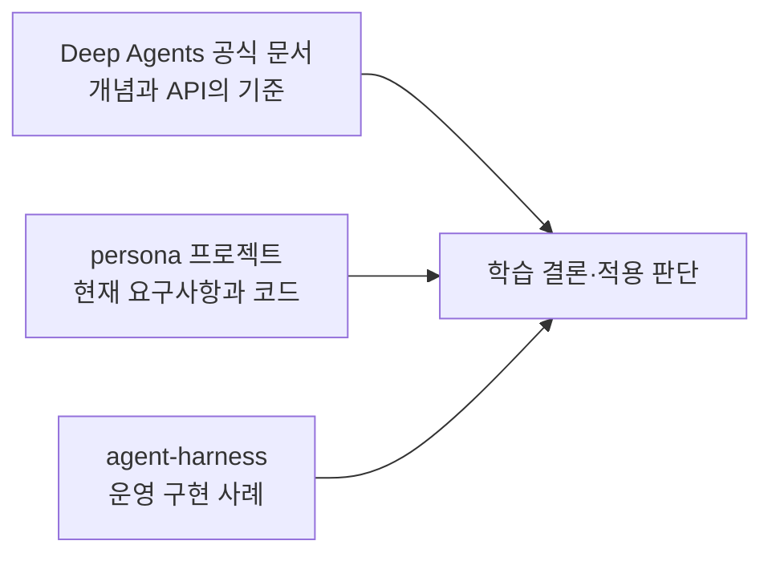
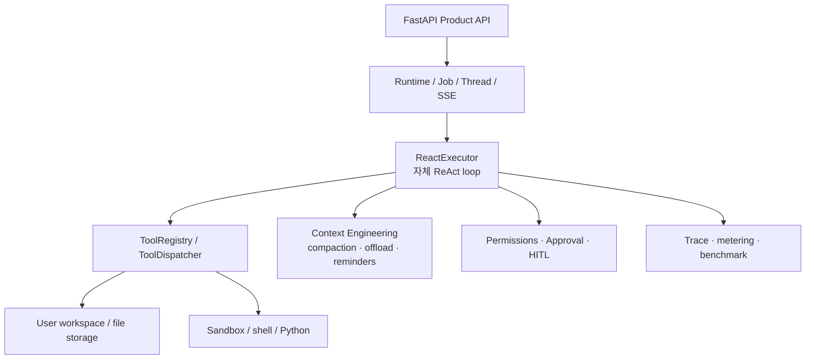

# Agent Harness 참고 지도

> 참고 프로젝트: `/Users/6161990src/LGUplusIxiO/agent-harness`  
> 역할: Deep Agents 공식 문서를 대체하지 않는 구현 사례 비교용 참고서

## 1. 이 참고서를 사용하는 원칙

`agent-harness`는 Deep Agents 라이브러리를 직접 사용하는 프로젝트가 아니다.
순수 Python으로 ReAct executor, Tool registry, context compaction, sandbox, MCP, Human-in-the-loop을
구현한 더 큰 범용 Agent runtime이다.

따라서 다음 순서를 지킨다.

1. **공식 문서**로 Deep Agents가 제공하는 기능과 API를 먼저 확인한다.
2. **persona 코드**로 현재 기능·범위·위험을 확인한다.
3. **agent-harness**에서 비슷한 문제를 어떻게 구현했는지 읽는다.
4. 그대로 복사하지 않고 규모, 프레임워크, 운영 요구사항 차이를 비교해 적용 여부를 판단한다.

## 2. 왜 그대로 복사하면 안 되는가?

| 항목 | persona | agent-harness |
|---|---|---|
| 목적 | 통화 데이터 기반 페르소나와 대신받기 | 범용 Agent runtime + GAIA benchmark + 제품 API |
| Agent 기반 | Deep Agents / LangGraph | 자체 Python ReAct executor |
| 규모 | MVP, 사용자별 단일 페르소나·캐릭터 | MCP, sandbox, 파일 workspace, job, trace, benchmark |
| 현재 저장 | 인메모리 Store + InMemorySaver | 사용자 workspace, 파일 메타데이터, thread/job 서비스 |
| 핵심 우선순위 | 페르소나 정확도·통화 응답 안전성 | 범용 Tool 실행·관측성·benchmark 회귀 방지 |

agent-harness의 구조는 production-ready 패턴을 많이 보여준다. 현재 persona에 모든 계층을
**즉시 구현할 이유는 없지만**, 학습 관점에서는 각 계층이 어떤 문제를 해결하려고 생겼는지
전부 살펴본다. 각 학습 주제에서 적용 판단은 별도로 “지금 persona의 문제를 해결하는 최소 변경인가?”를
검토한다.

> **학습은 넓게:** 모든 계층의 문제·구조·트레이드오프를 이해한다. 
> **적용은 선택적으로:** 현재 요구사항과 위험에 맞는 계층만 구현한다.

## 3. 핵심 구조 요약

핵심 실행 루프는 `agent_harness/agent/executor.py`의 `ReactExecutor`이고, README 설명에 따르면
대략 `context compact → thinking → call LLM → execute tools → reminders` 순서를 반복한다.

## 4. Deep Agents 17개 주제와 참고 위치

각 챕터를 공부할 때 아래 파일을 **필요한 만큼만** 읽는다. 이 표는 코드가 변경되면 다시 검증한다.

| Deep Agents 주제 | agent-harness 참고 위치 | 비교 관점 |
|---|---|---|
| Tools | `agent_harness/agent/tool_registry.py`, `agent_harness/agent/harness/runtime/tools/` | Tool schema, dispatcher, timeout, 결과 처리 |
| Backends | `agent_harness_interface/files.py`, `api/services/*`, `tests/test_workspace_*` | Agent 파일 workspace와 서비스 도메인 저장소 분리 |
| Permissions | `agent_harness/agent/harness/runtime/permissions.py`, `tests/test_workspace_path_guard.py` | 파일 경로와 Tool별 허용 범위 |
| Multimodality | `runtime/tools/analyze_image.py`, `audio_qa.py`, `youtube_video_qa.py` | 이미지·오디오·영상 Tool의 분리 |
| Sandboxes | `agent_harness/sandbox/`, `tests/test_tool_timeout.py` | 코드 실행 격리, idle/absolute timeout |
| Interpreters | `sandbox/python_runner.py`, `sandbox/shell_tool.py` | Deep Agents interpreter와 자체 코드 실행의 차이 |
| Dynamic subagents | `agent_harness/agent/executor.py`, `tests/test_subagent_specs.py` | 작업별 Agent 생성과 Tool 제한 |
| Event streaming | `agent_harness_interface/source_events.py`, `api/services/executor/event_pipeline.py` | 내부 실행 이벤트와 SSE 분리 |
| Streaming | `api/services/ask/stream.py`, `agent_harness_interface/sse_emitter.py` | 사용자-facing SSE 재연결·버퍼링 |
| Skills | `runtime/skills/`, `tests/test_executor_skills_index.py` | Skill 탐색·주입·materialize |
| Memory | `context/episodic_memory.py`, `context/ace/` | Agent 메모와 도메인 데이터 구분 |
| Context engineering | `context/compaction.py`, `context/offload.py`, `docs/doc/04-context-engineering.md` | 긴 Tool 결과, 마스킹, compaction |
| Profiles | `agent_harness/agent/config.py`, model registry | Harness 설정 preset과 모델 capability |
| Subagents | `agent_harness/agent/executor.py`, `tests/test_subagent_isolation.py` | 메인 상태 오염을 막는 격리 |
| Async subagents | `agent_harness/agent/executor.py`, execution events | background/child 실행과 lifecycle |
| Human-in-the-loop | `api/services/hitl/`, `runtime/approval_manager.py` | Tool 승인, 대기, TTL, 재개 |
| Grading rubrics | `agent_harness/benchmarks/`, `eval/`, `tests/test_*trace*` | 회귀 테스트와 실행 trajectory 평가 |

## 5. 지금까지 학습한 주제와 연결

### Tools

persona는 Deep Agents의 `@tool`과 `make_character_tools(user_id)`를 사용한다. Agent Harness는
`ToolRegistry`, `ToolDispatcher`, `make_tool()`을 중심으로 자체 Tool 호출 루프를 구현한다.

비교할 질문:

- Tool 입력 스키마를 어떻게 모델에 전달하는가?
- Tool timeout과 오류 결과는 어디서 통제하는가?
- Tool의 내부 인자(예: timeout 설정)를 LLM schema에서 어떻게 숨기는가?
- Tool 결과를 사용자 응답과 어떻게 분리하는가?

### Backends

persona의 `app/store/`는 도메인 데이터 저장소이고, Deep Agents backend는 Agent 파일 작업 공간이다.
Agent Harness도 사용자 workspace 파일, 파일 메타데이터 repository, 실행 Tool을 분리한다.

특히 `agent_harness_interface/files.py`의 `FileObjectStorage`와 `FileMetadataRepository`는
파일 본문과 메타데이터·소유권을 구분하는 사례다. 이는 persona의 `character_store`와
`image_store`를 분리한 현재 설계와 비교할 수 있다.

## 6. 앞으로 질문할 때의 진행 방식

사용자가 예를 들어 다음처럼 질문할 수 있다.

> “Backends에서 이 프로젝트는 왜 `StateBackend`를 쓰고, agent-harness는 workspace를 별도로 뒀어?”

답변은 아래 형식으로 진행한다.

1. 공식 Deep Agents 문서의 기준
2. persona의 현재 코드 경로와 동작
3. agent-harness의 관련 파일·구현 패턴
4. 공통점과 차이점
5. persona에 적용할지 여부와 최소 변경안

실제 변경을 요청받기 전에는 참고 프로젝트의 패턴을 persona에 복사하지 않는다.

## 7. 첫 번째 추천 비교 실습

다음 Backends 수업에서 아래 질문을 함께 살펴본다.

> persona의 `character_store`를 Deep Agents `StoreBackend`로 바꾸는 것이 좋은가?

예상 결론:

- `character_store`: 서비스의 정식 도메인 데이터 → DB repository 방향
- `StoreBackend`: Agent가 파일 Tool로 다루는 장기 작업 파일·메모 → Agent context 방향
- agent-harness의 workspace: 사용자 파일 관리라는 별도 제품 기능 → 그대로 도입할 필요 없음

이 비교를 통해 “저장한다”는 공통점보다 **누가 어떤 API로 무엇을 저장하는가**가 더 중요하다는 점을 학습한다.
