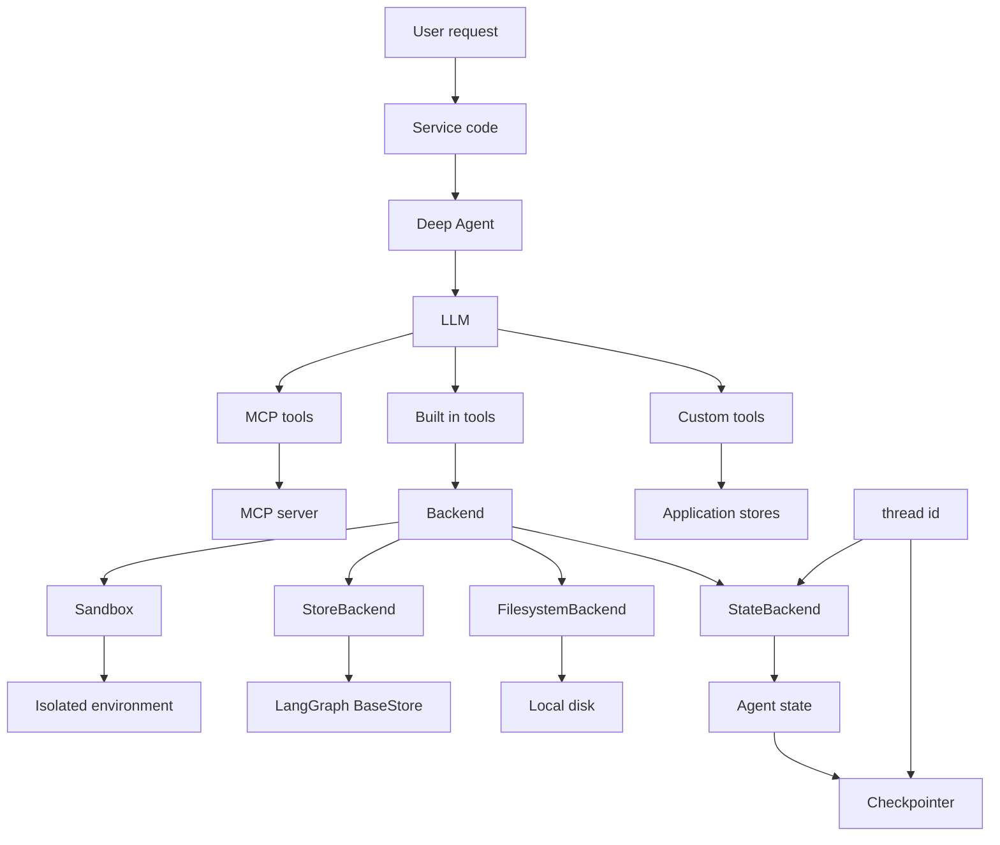
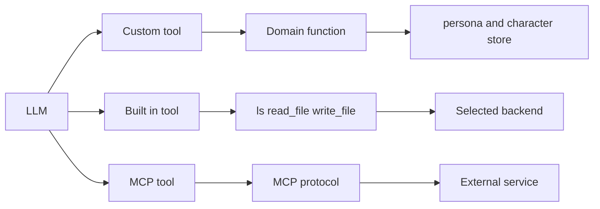
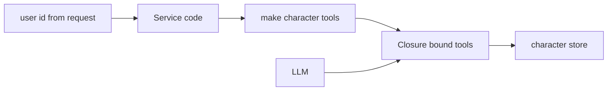
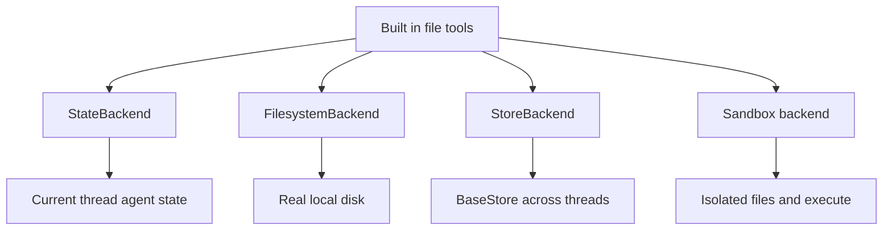
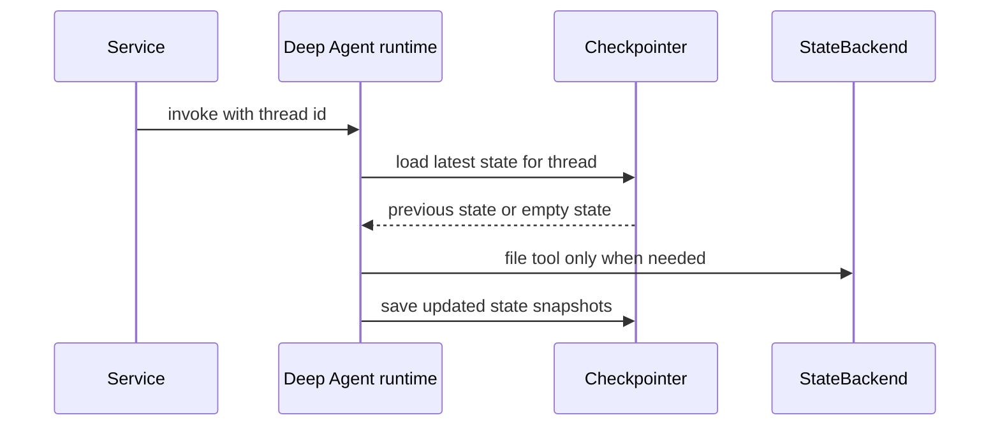
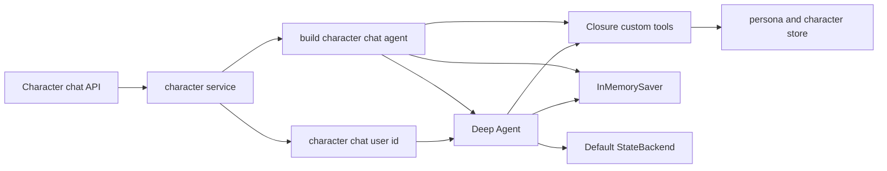
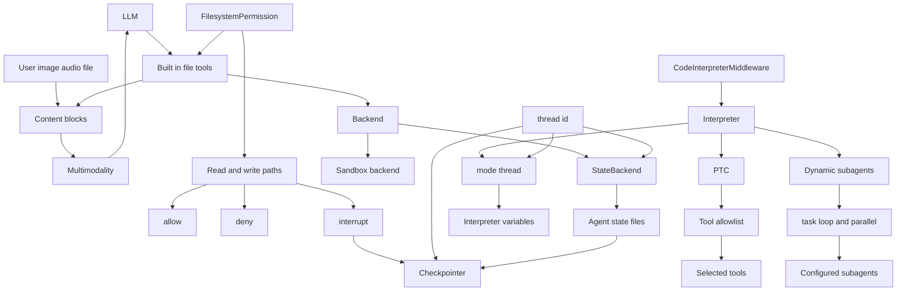

# 01–07 통합 지도 — Tool, Backend, 상태의 연결

> 범위: Tools(01), Backends(02), Permissions~Dynamic subagents(03–07)의 핵심 연결.  
> 표기: **현재 사용**은 이 persona POC 코드에 연결된 것, **선택지**는 학습한 개념이지만 아직 연결하지 않은 것이다.

## 1. 한 장으로 보는 전체 관계



### 화살표를 문장으로 읽기

1. **LLM은 Tool을 선택**한다. Custom, Built-in, MCP Tool 모두 LLM 입장에서는 “호출 가능한 API”다.
2. Built-in 파일 Tool만 Backend에 연결된다. 예: `read_file`과 `write_file`은 선택한 backend를 통해 파일을 다룬다.
3. `thread_id`는 같은 대화/작업 단위를 식별한다. `StateBackend`의 파일 범위와 Checkpointer의 조회 키에 연결된다.
4. Checkpointer는 Agent state의 snapshot을 저장한다. `StateBackend` 파일이 Agent state 안에 있다면 그 snapshot에 포함될 수 있다.

## 2. Tool의 세 종류와 실행 대상



| Tool 종류 | 누가 제공하나 | 예 | 실제로 가는 곳 | 현재 persona |
|---|---|---|---|---|
| Custom Tool | 이 프로젝트 | `get_persona`, `save_character` | `app/store/` 같은 도메인 로직 | **사용** |
| Built-in Tool | Deep Agents harness | `ls`, `read_file`, `write_file`, `task` | backend 또는 subagent runtime | 기본 등록, 파일 사용은 거의 없음 |
| MCP Tool | 외부 MCP 서버 | CRM 조회, browser, SaaS API | MCP protocol 너머 외부 서비스 | 미사용 |

### Closure는 Custom Tool 앞의 서버 경계



`make_character_tools(user_id)`가 Tool을 만들 때 서버의 `user_id`를 closure에 고정한다. 그래서 LLM은 `save_character(profile)`을 호출할 수 있지만, `다른 user_id`를 인자로 골라 저장할 수는 없다.

> Closure는 Custom Tool의 **도메인 대상 경계**다. Backend의 파일 경로 권한이나 로그인 인증을 대체하지는 않는다.

## 3. Built-in 파일 Tool과 Backend 선택지



| Backend | 파일이 있는 곳 | 범위 | `execute` | 현재 판단 |
|---|---|---|---|---|
| `StateBackend` | LangGraph Agent state | 현재 `thread_id` | 없음 | **기본값으로 사용** |
| `FilesystemBackend` | 실제 로컬 디스크 | 설정한 root directory | 없음 | HTTP persona 서버에는 연결하지 않음 |
| `StoreBackend` | LangGraph `BaseStore` | namespace 설계에 따라 thread 간 공유 가능 | 없음 | 미사용 |
| Sandbox backend | 격리 VM/container | provider가 정한 sandbox 범위 | 있음 | 미사용 |

Sandbox는 Tool 자체가 아니라 Backend다. 다만 이 backend를 고르면 Built-in 파일 Tool의 대상이 sandbox가 되고, `execute` Tool도 추가되어 LLM에는 Tool처럼 보인다.

## 4. thread id와 Checkpointer의 정확한 위치



현재 캐릭터 편집은 Service가 다음 key를 만들고 Agent runtime에 전달한다.

```python
thread_id = f"character-chat:{user_id}"
```

| 개념 | 질문에 대한 답 |
|---|---|
| `thread_id` | “어느 대화/작업 단위인가?”를 가리키는 key |
| Checkpointer | “이 thread의 이전 Agent state가 있나?”를 조회하고 새 snapshot을 저장 |
| `StateBackend` | Agent가 파일 Tool을 썼을 때 그 파일을 current Agent state에 둠 |
| `app/store/` | Persona/Character 같은 정식 도메인 데이터를 직접 저장. Checkpointer/Backend와 별개 |

## 5. 현재 persona POC에 실제로 켜진 선



현재 연결되지 않은 선택지:

```text
MCP Tool          not connected
FilesystemBackend not connected
StoreBackend      not connected
Sandbox backend   not connected
```

## 6. 요청한 키워드 전체 연결 지도



### 이 그림을 위에서 아래로 읽기

1. **Multimodality**: 사용자가 준 이미지·오디오·파일은 `content block`으로 메시지에 담긴다. 멀티모달 지원 LLM만 이를 해석한다. Built-in `read_file`도 미디어 파일을 content block으로 돌려줄 수 있다.
2. **FilesystemPermission**: Built-in 파일 Tool의 호출을 경로·읽기/쓰기로 검사한다. 결과는 `allow`, `deny`, 또는 `interrupt`다. Custom Tool과 MCP Tool에는 자동 적용되지 않으며, Sandbox의 `execute`도 이 규칙으로 통제되지 않는다.
3. **interrupt와 Checkpointer**: `interrupt`는 작업을 멈추고 사람의 승인을 기다린다. 이후 같은 실행을 재개해야 하므로 Checkpointer가 필요하다.
4. **StateBackend와 thread_id**: `thread_id`는 StateBackend 파일과 Checkpointer state를 어느 대화 단위로 분리·조회할지 정한다.
5. **Interpreter 체인**: `CodeInterpreterMiddleware`가 Interpreter를 Agent에 넣는다. `mode="thread"`에서는 Interpreter 변수가 같은 thread 범위에 남을 수 있다. Checkpointer를 추가하면 그 Interpreter snapshot도 Agent state history에 포함될 수 있다.
6. **PTC와 Dynamic subagents**: PTC는 allowlist에 든 Tool을 Interpreter 코드가 반복·분기·병렬 호출하게 한다. Dynamic subagents는 그 Interpreter가 `task()`로 설정된 subagent를 반복·병렬 호출하는 기능이다.

### 키워드 누락 검사

| 키워드 | 이 맵의 직접 연결 | 현재 persona POC |
|---|---|---|
| `FilesystemPermission` | Built-in file tools → `allow`/`deny`/`interrupt` | 미사용 |
| `allow`, `deny`, `interrupt` | permission rule의 세 결과 | 미사용 |
| Checkpointer | `thread_id`, StateBackend state, `interrupt` 재개 | 캐릭터 편집에 사용 |
| Multimodality | content block → 멀티모달 LLM | 입력 미사용 |
| content block | 사용자 미디어 / `read_file` 결과 → LLM | 입력 미사용 |
| `mode="thread"` | Interpreter 변수의 thread 범위 | Interpreter 미사용 |
| Interpreter 변수 | Interpreter 내부 계산 중간값 | 미사용 |
| PTC | Interpreter → Tool allowlist → 선택된 Tool | 미사용 |
| Dynamic subagents | Interpreter → `task()` → configured subagents | 미사용 |
| `CodeInterpreterMiddleware` | Interpreter를 Agent에 추가하는 middleware | 미사용 |

> 주의: PTC와 Dynamic subagents는 Interpreter runtime의 Beta 기능이다. PTC/`task()` 호출은 일반 Tool 호출 경로와 달라, 일반 Tool별 승인 규칙이 자동으로 각각 적용된다고 가정하면 안 된다.

## 기억할 세 문장

1. **Tool은 LLM이 호출하는 기능**, Backend는 Built-in 파일 Tool이 작업할 **장소**다.
2. **Closure는 Custom Tool이 누구의 데이터를 다룰지 서버가 고정하는 방법**이다.
3. **thread_id는 대화 식별자, Checkpointer는 그 대화의 Agent state snapshot 저장소**다. `app/store/`의 Persona/Character와는 다른 저장 경로다.

> 공식 참고: [Tools](https://docs.langchain.com/oss/python/deepagents/tools), [Backends](https://docs.langchain.com/oss/python/deepagents/backends), [Sandboxes](https://docs.langchain.com/oss/python/deepagents/sandboxes)
