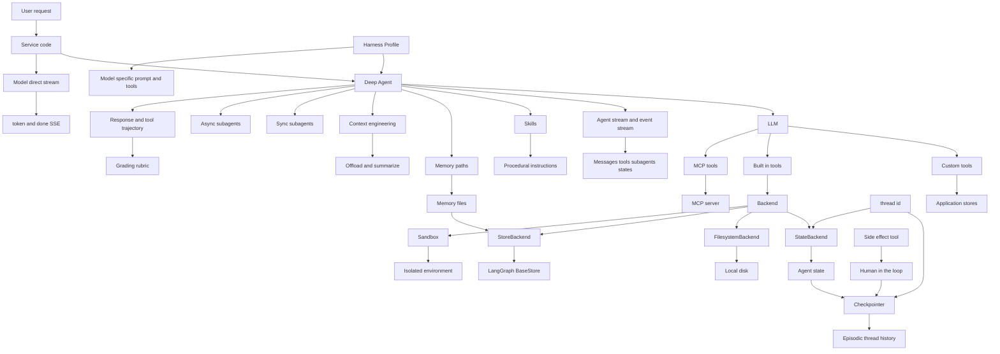
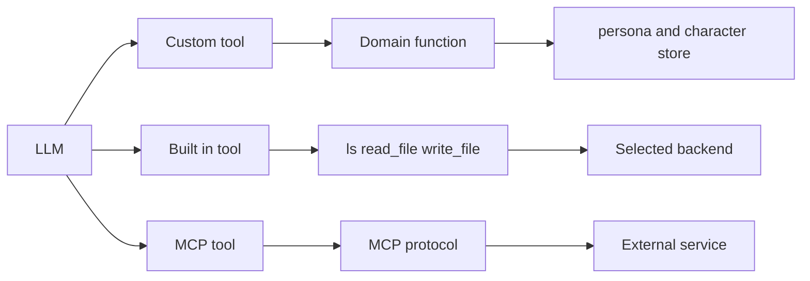
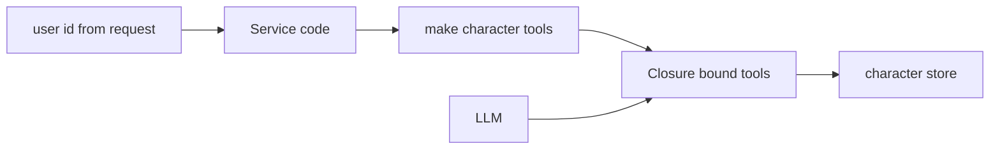
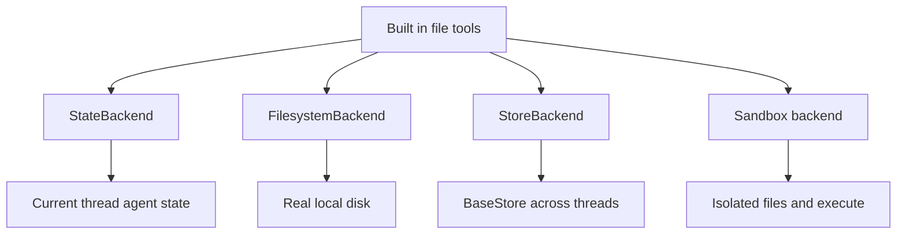
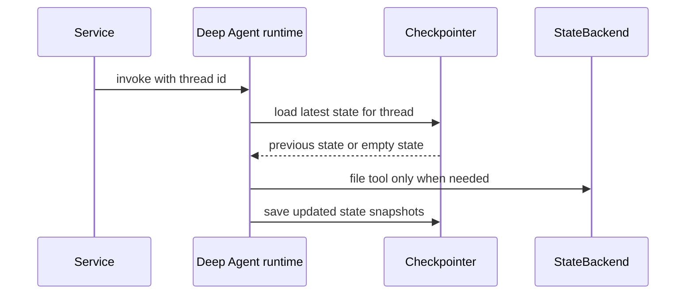
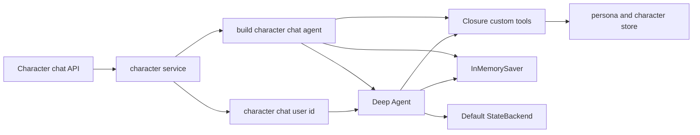

# 01–17 통합 지도 — Tool, 실행, 상태, 문맥, 조향의 연결

> 범위: Tools(01)부터 Grading rubrics(17)까지의 핵심 연결.
> 표기: **현재 사용**은 이 persona POC 코드에 연결된 것, **선택지**는 학습한 개념이지만 아직 연결하지 않은 것이다.

## 1. 한 장으로 보는 전체 관계



### 화살표를 문장으로 읽기

1. **LLM은 Tool을 선택**한다. Custom, Built-in, MCP Tool 모두 LLM 입장에서는 “호출 가능한 API”다.
2. Built-in 파일 Tool만 Backend에 연결된다. 예: `read_file`과 `write_file`은 선택한 backend를 통해 파일을 다룬다.
3. `thread_id`는 같은 대화/작업 단위를 식별한다. `StateBackend`의 파일 범위와 Checkpointer의 조회 키에 연결된다.
4. Checkpointer는 Agent state의 snapshot을 저장한다. `StateBackend` 파일이 Agent state 안에 있다면 그 snapshot에 포함될 수 있다.
5. **두 종류의 stream**이 있다. 현재 대신받기는 모델 직접 stream을 `token`/`done` SSE로 바꾸고, Deep Agent stream/Event stream은 Tool·subagent를 포함한 Agent 실행 과정을 관찰한다.
6. **Skill은 작업 방법**, **Memory는 기억할 파일**, **StoreBackend는 Agent 파일을 thread 간 보관할 장소**다.

## 2. Tool의 세 종류와 실행 대상



| Tool 종류 | 누가 제공하나 | 예 | 실제로 가는 곳 | 현재 persona |
|---|---|---|---|---|
| Custom Tool | 이 프로젝트 | `get_persona`, `save_character` | `app/store/` 같은 도메인 로직 | **사용** |
| Built-in Tool | Deep Agents harness | `ls`, `read_file`, `write_file`, `task` | backend 또는 subagent runtime | 기본 등록, 파일 사용은 거의 없음 |
| MCP Tool | 외부 MCP 서버 | CRM 조회, browser, SaaS API | MCP protocol 너머 외부 서비스 | 미사용 |

### Closure는 Custom Tool 앞의 서버 경계



`make_character_tools(user_id)`가 Tool을 만들 때 서버의 `user_id`를 closure에 고정한다. 그래서 LLM은 `save_character(profile)`을 호출할 수 있지만, `다른 user_id`를 인자로 골라 저장할 수는 없다.

> Closure는 Custom Tool의 **도메인 대상 경계**다. Backend의 파일 경로 권한이나 로그인 인증을 대체하지는 않는다.

## 3. Built-in 파일 Tool과 Backend 선택지



| Backend | 파일이 있는 곳 | 범위 | `execute` | 현재 판단 |
|---|---|---|---|---|
| `StateBackend` | LangGraph Agent state | 현재 `thread_id` | 없음 | **기본값으로 사용** |
| `FilesystemBackend` | 실제 로컬 디스크 | 설정한 root directory | 없음 | HTTP persona 서버에는 연결하지 않음 |
| `StoreBackend` | LangGraph `BaseStore` | namespace 설계에 따라 thread 간 공유 가능 | 없음 | 미사용 |
| Sandbox backend | 격리 VM/container | provider가 정한 sandbox 범위 | 있음 | 미사용 |

Sandbox는 Tool 자체가 아니라 Backend다. 다만 이 backend를 고르면 Built-in 파일 Tool의 대상이 sandbox가 되고, `execute` Tool도 추가되어 LLM에는 Tool처럼 보인다.

## 4. thread id와 Checkpointer의 정확한 위치



현재 캐릭터 편집은 Service가 다음 key를 만들고 Agent runtime에 전달한다.

```python
thread_id = f"character-chat:{user_id}"
```

| 개념 | 질문에 대한 답 |
|---|---|
| `thread_id` | “어느 대화/작업 단위인가?”를 가리키는 key |
| Checkpointer | “이 thread의 이전 Agent state가 있나?”를 조회하고 새 snapshot을 저장 |
| `StateBackend` | Agent가 파일 Tool을 썼을 때 그 파일을 current Agent state에 둠 |
| `app/store/` | Persona/Character 같은 정식 도메인 데이터를 직접 저장. Checkpointer/Backend와 별개 |

## 5. 현재 persona POC에 실제로 켜진 선



현재 연결되지 않은 선택지:

```text
MCP Tool          not connected
FilesystemBackend not connected
StoreBackend      not connected
Sandbox backend   not connected
```

## 6. 요청한 키워드 전체 연결 지도

```mermaid
flowchart TB
  LLM[LLM]
  UserMedia[User image audio file]
  Blocks[Content blocks]
  Multi[Multimodality]

  LLM --> Builtin[Built in file tools]
  UserMedia --> Blocks
  Blocks --> Multi
  Multi --> LLM
  Builtin --> Blocks

  Builtin --> Backend[Backend]
  Backend --> State[StateBackend]
  Backend --> Sandbox[Sandbox backend]

  Permission[FilesystemPermission] --> Builtin
  Permission --> Operations[Read and write paths]
  Operations --> Allow[allow]
  Operations --> Deny[deny]
  Operations --> Interrupt[interrupt]
  Interrupt --> Checkpointer[Checkpointer]

  Thread[thread id] --> Checkpointer
  Thread --> State
  State --> AgentState[Agent state files]
  AgentState --> Checkpointer

  Middleware[CodeInterpreterMiddleware] --> Interpreter[Interpreter]
  Interpreter --> Mode[mode thread]
  Mode --> Variables[Interpreter variables]
  Thread --> Mode
  Interpreter --> PTC[PTC]
  PTC --> Allowlist[Tool allowlist]
  Allowlist --> SelectedTools[Selected tools]
  Interpreter --> Dynamic[Dynamic subagents]
  Dynamic --> Task[task loop and parallel]
  Task --> Subagents[Configured subagents]

  Agent[Deep Agent] --> AgentStream[agent stream]
  Agent --> EventStream[agent stream events]
  AgentStream --> Chunk[One stream chunks]
  EventStream --> Projections[Messages tools subagents values]
  Projections --> UI[Agent progress UI]

  Direct[Chat model direct stream] --> Text[Text chunks]
  Text --> SSE[token and done SSE]
  CallId[call id] --> CallHistory[conversation store]
  CallHistory --> Direct

  Agent --> Skills[Skills]
  Skills --> SkillMeta[Name description]
  SkillMeta --> SkillGuide[SKILL md when relevant]
  SkillGuide --> Procedure[Procedural instructions]
  Procedure --> SelectedTools

  Agent --> Memory[Memory paths]
  Memory --> MemoryFile[memories preferences md]
  MemoryFile --> Store[StoreBackend]
  Store --> Namespace[User or agent namespace]
  Thread --> Checkpointer
  Checkpointer --> Episodic[Episodic thread history]

  Input[System prompt memory skills tool prompts] --> ContextEng[Context engineering]
  Runtime[Runtime context per invoke] --> ContextEng
  ContextEng --> Agent
  Agent --> Compression[Offloading and summarization]
  Agent --> ContextIsolation[Context isolation]
  ContextIsolation --> SyncSub[Sync subagent]
  Agent --> AsyncSub[Async subagent job]
  AsyncSub --> JobId[Job id status update cancel]

  ModelKey[Resolved model key] --> HarnessProfile[Harness Profile]
  HarnessProfile --> PromptSuffix[System prompt suffix]
  HarnessProfile --> GP[General purpose subagent setting]
  PromptSuffix --> Agent
  GP --> SyncSub

  SensitiveTool[Sensitive custom tool] --> HITL[Human in the loop]
  HITL --> InterruptOn[interrupt on]
  InterruptOn --> Pending[Pending tool action]
  Pending --> Decision[approve edit reject respond]
  Decision --> Resume[Command resume same thread id]
  Resume --> Checkpointer
  Resume --> SensitiveTool

  Agent --> Trajectory[Response and tool trajectory]
  Direct --> Answer[Phone response]
  Answer --> Rubric[Grading rubric]
  Trajectory --> Rubric
  Rubric --> Evaluation[Quality score and failure reason]
```



### 이 그림을 위에서 아래로 읽기

1. **Multimodality**: 사용자가 준 이미지·오디오·파일은 `content block`으로 메시지에 담긴다. 멀티모달 지원 LLM만 이를 해석한다. Built-in `read_file`도 미디어 파일을 content block으로 돌려줄 수 있다.
2. **FilesystemPermission**: Built-in 파일 Tool의 호출을 경로·읽기/쓰기로 검사한다. 결과는 `allow`, `deny`, 또는 `interrupt`다. Custom Tool과 MCP Tool에는 자동 적용되지 않으며, Sandbox의 `execute`도 이 규칙으로 통제되지 않는다.
3. **interrupt와 Checkpointer**: `interrupt`는 작업을 멈추고 사람의 승인을 기다린다. 이후 같은 실행을 재개해야 하므로 Checkpointer가 필요하다.
4. **StateBackend와 thread_id**: `thread_id`는 StateBackend 파일과 Checkpointer state를 어느 대화 단위로 분리·조회할지 정한다.
5. **Interpreter 체인**: `CodeInterpreterMiddleware`가 Interpreter를 Agent에 넣는다. `mode="thread"`에서는 Interpreter 변수가 같은 thread 범위에 남을 수 있다. Checkpointer를 추가하면 그 Interpreter snapshot도 Agent state history에 포함될 수 있다.
6. **PTC와 Dynamic subagents**: PTC는 allowlist에 든 Tool을 Interpreter 코드가 반복·분기·병렬 호출하게 한다. Dynamic subagents는 그 Interpreter가 `task()`로 설정된 subagent를 반복·병렬 호출하는 기능이다.
7. **08·09 Streaming**: `agent.stream()`과 `agent.stream_events()`는 Deep Agent 실행을 내보낸다. 전자는 하나의 iterator chunk를 앱이 `stream_mode`별로 분기하고, 후자는 messages·Tool·subagents 같은 typed projection을 나누어 소비한다. 현재 대신받기는 둘이 아니라 `build_model().stream()`의 text chunk를 SSE `token`/`done`으로 바꾼다. `call_id`는 이 스트림의 이전 통화 이력을 `conversation_store`에서 찾는 key다.
8. **10 Skills**: Skill은 Tool을 실행하는 권한이 아니라 “어떤 순서와 규칙으로 Tool을 쓸지”라는 절차적 지식이다. Agent는 name·description을 먼저 보고, 필요할 때 `SKILL.md`를 읽는다.
9. **11 Memory**: `memory=[...]`는 기억으로 읽고 갱신할 파일을 지정한다. `StoreBackend`는 그 파일을 thread 간 보관할 수 있는 Backend다. Checkpointer의 episodic thread history와 장기 Memory 파일은 같은 것이 아니다.
10. **12 Context engineering**: system prompt·Memory·Skills·Tool 설명은 입력 문맥이고, runtime context는 호출별 설정이다. Deep Agent는 문맥이 길어질 때 offloading·summarization을 쓸 수 있으며, subagent는 무거운 작업의 문맥을 부모에게서 격리한다. 현재 대신받기의 직접 모델 stream에는 이 자동 관리가 없다.
11. **13 Profiles**: Harness Profile은 `PersonaProfile` 도메인 데이터가 아니라 모델별 Agent 조립 규칙이다. 현재 `databricks-claude-opus-4-6` endpoint는 OpenAI 호환 모델로 해석되어 `openai:databricks-claude-opus-4-6` 키의 Profile이 적용된다. 이 Profile은 Tool 결과 안내를 더하고 기본 general-purpose subagent를 끈다.
12. **14·15 Delegation**: sync subagent는 부모 Agent가 결과를 기다리는 위임이고, async subagent는 job ID만 받고 진행 상태·갱신·취소를 관리하는 백그라운드 위임이다. 현재 POC에는 사용자 정의 sync/async subagent가 없다. Profile이 자동 기본 sync subagent도 껐다.
13. **16 HITL**: `interrupt_on`으로 민감 Tool 호출 직전에 멈춘다. 사람의 `approve`·`edit`·`reject`·`respond` 결정은 같은 `thread_id`와 Checkpointer 상태에서 `Command(resume=...)`로 이어진다. 현재는 HITL 미설정이다.
14. **17 Rubric**: 최종 답변뿐 아니라 Tool trajectory도 Persona 일관성·사실성·개인정보·안전한 실패 같은 제품 행동 기준으로 평가한다. 현재는 평가 실행기를 아직 붙이지 않았고, 단위/loop 테스트와 별개다.

### 키워드 누락 검사

| 키워드 | 이 맵의 직접 연결 | 현재 persona POC |
|---|---|---|
| `FilesystemPermission` | Built-in file tools → `allow`/`deny`/`interrupt` | 미사용 |
| `allow`, `deny`, `interrupt` | permission rule의 세 결과 | 미사용 |
| Checkpointer | `thread_id`, StateBackend state, `interrupt` 재개 | 캐릭터 편집에 사용 |
| Multimodality | content block → 멀티모달 LLM | 입력 미사용 |
| content block | 사용자 미디어 / `read_file` 결과 → LLM | 입력 미사용 |
| `mode="thread"` | Interpreter 변수의 thread 범위 | Interpreter 미사용 |
| Interpreter 변수 | Interpreter 내부 계산 중간값 | 미사용 |
| PTC | Interpreter → Tool allowlist → 선택된 Tool | 미사용 |
| Dynamic subagents | Interpreter → `task()` → configured subagents | 미사용 |
| `CodeInterpreterMiddleware` | Interpreter를 Agent에 추가하는 middleware | 미사용 |
| `agent.stream()` | 하나의 iterator에서 Agent chunk를 받아 앱이 분기 | 미사용 |
| `agent.stream_events()` | messages·Tool·subagents 등의 typed projection | 미사용 |
| 모델 직접 stream | `build_model().stream()` → `token`/`done` SSE | 대신받기에 사용 |
| SSE `token`, `done` | text chunk 전달, 완료·통화 이력 저장 완료 알림 | 대신받기에 사용 |
| `call_id` | `conversation_store`에서 같은 통화 이력 조회 | 대신받기에 사용 |
| Skills | 작업 방법·규칙을 단계적으로 읽는 절차적 지식 | 서비스 Agent에는 미설정 |
| Memory | `memory=[...]`로 지정한 장기 기억 파일 | 미설정 |
| StoreBackend와 Memory | Memory 파일을 thread 간 보관하는 조합 | 둘 다 미설정 |
| Context engineering | 입력 문맥·runtime context·압축·문맥 격리의 설계 | 직접 stream 경로에는 미적용 |
| Offloading / summarization | 큰 Tool 결과를 파일로 빼거나 오래된 문맥을 요약 | Deep Agent 기본 기능, 현재 직접 stream에는 없음 |
| Harness Profile | 모델별 prompt/tool/middleware/subagent 조립 규칙 | **Databricks Claude endpoint에 사용** |
| `openai:databricks-claude-opus-4-6` | OpenAI 호환 ChatOpenAI가 해석하는 실제 Profile key | **사용** |
| Sync subagent | 부모가 결과를 기다리는 문맥 격리 위임 | 사용자 정의 없음, 자동 기본도 Profile로 비활성화 |
| Async subagent | job ID·상태·갱신·취소를 가진 백그라운드 위임 | 미사용 |
| Human-in-the-loop | 민감 Tool 직전 interrupt 후 사람 결정 | 미사용 |
| `approve` / `edit` / `reject` / `respond` | HITL에서 Tool 호출을 재개·수정·취소·대체하는 결정 | 미사용 |
| Grading rubric | 실제 모델의 답변/Tool trajectory가 제품 행동 계약을 지키는지 평가 | 미사용 |

> 주의: PTC와 Dynamic subagents는 Interpreter runtime의 Beta 기능이다. PTC/`task()` 호출은 일반 Tool 호출 경로와 달라, 일반 Tool별 승인 규칙이 자동으로 각각 적용된다고 가정하면 안 된다.

## 기억할 여덟 문장

1. **Tool은 LLM이 호출하는 기능**, Backend는 Built-in 파일 Tool이 작업할 **장소**다.
2. **Closure는 Custom Tool이 누구의 데이터를 다룰지 서버가 고정하는 방법**이다.
3. **thread_id는 대화 식별자, Checkpointer는 그 대화의 Agent state snapshot 저장소**다. `app/store/`의 Persona/Character와는 다른 저장 경로다.
4. **모델 직접 stream은 빠른 텍스트 전달**, Agent stream/Event stream은 Tool·subagent를 포함한 **Agent 실행 관찰**이다.
5. **Skill은 작업 방법, Memory는 기억할 파일, StoreBackend는 그 파일을 둘 장소**다.
6. **Context engineering은 모델에 무엇을 얼마나 넣을지의 설계**이며, subagent는 큰 작업 문맥을 격리하는 한 방법이다.
7. **Harness Profile은 모델별 Agent 조립 규칙**, `PersonaProfile`은 사용자의 도메인 데이터다.
8. **HITL은 위험한 실행을 멈추는 장치**, Rubric은 실행 후 Agent 행동 품질을 재는 기준표다.

> 공식 참고: [Tools](https://docs.langchain.com/oss/python/deepagents/tools), [Backends](https://docs.langchain.com/oss/python/deepagents/backends), [Event streaming](https://docs.langchain.com/oss/python/deepagents/event-streaming), [Streaming](https://docs.langchain.com/oss/python/deepagents/streaming), [Skills](https://docs.langchain.com/oss/python/deepagents/skills), [Memory](https://docs.langchain.com/oss/python/deepagents/memory), [Context engineering](https://docs.langchain.com/oss/python/deepagents/context-engineering), [Profiles](https://docs.langchain.com/oss/python/deepagents/profiles), [Subagents](https://docs.langchain.com/oss/python/deepagents/subagents), [Async subagents](https://docs.langchain.com/oss/python/deepagents/async-subagents), [Human-in-the-loop](https://docs.langchain.com/oss/python/deepagents/human-in-the-loop), [Grading rubrics](https://docs.langchain.com/oss/python/deepagents/grading-rubrics)
