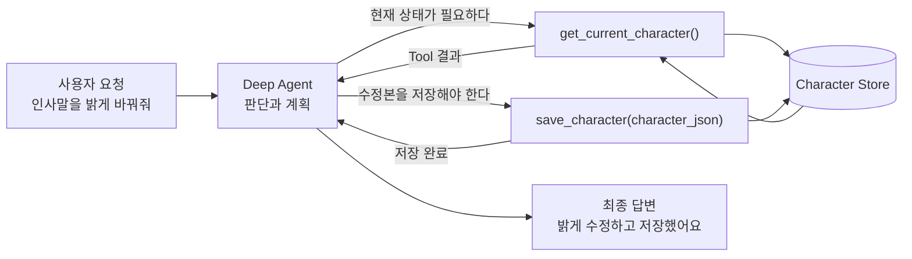
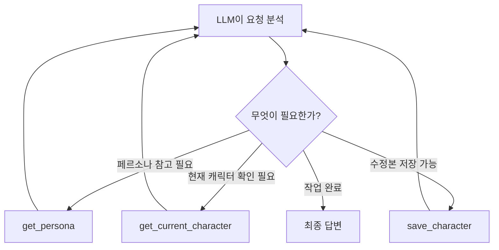
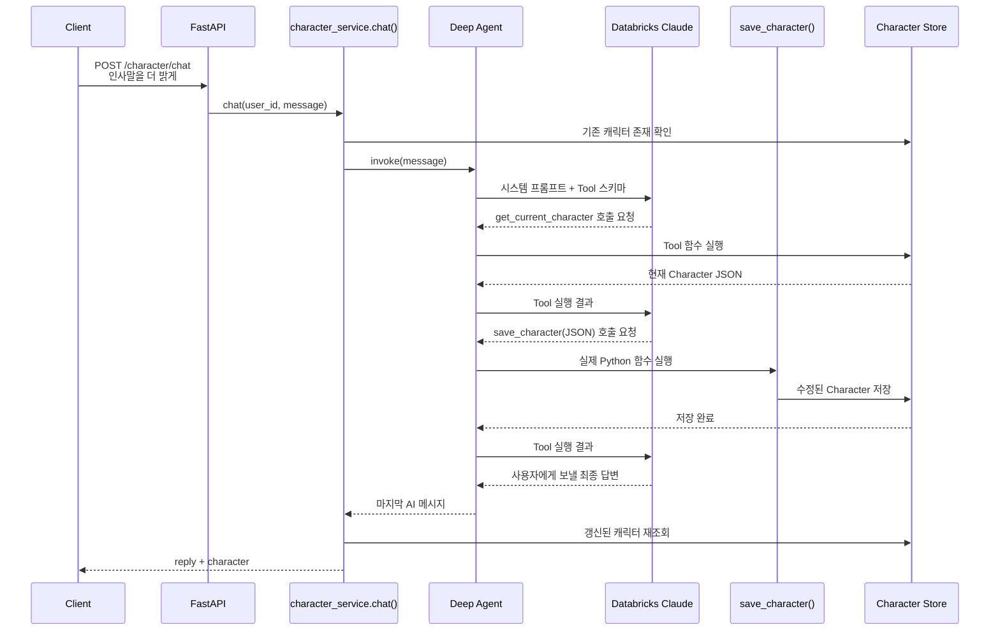
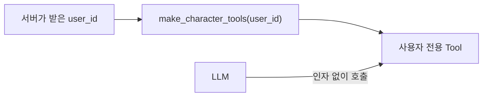
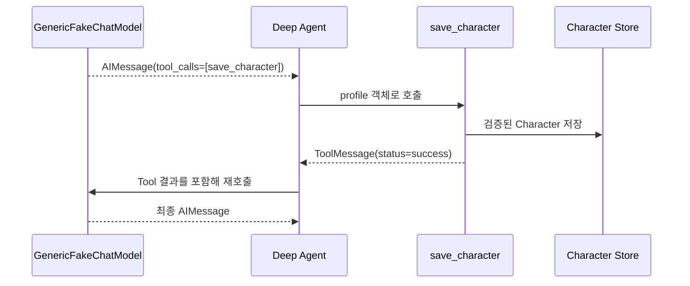

# 01. Tools — 에이전트의 손과 감각

> 공식 문서: [Deep Agents — Tools](https://docs.langchain.com/oss/python/deepagents/tools)  
> 학습 프로젝트: 통화 데이터 기반 persona 서비스  
> 확인한 설치 버전: `deepagents==0.6.12`

## 1. Mental model

LLM은 본질적으로 텍스트를 입력받아 다음 텍스트를 생성한다. 데이터베이스를 직접 읽거나 캐릭터를 저장할 수는 없다.
그걸 도와주는 애가 Tool
**Tool**은 LLM이 외부 세계에 정해진 방식으로 요청을 보낼 수 있도록 공개한 함수다.



Deep Agent가 직접 DB를 만지는 것은 아니다.

1. LLM이 어떤 Tool을 호출할지 판단한다.
2. Deep Agents/LangChain 런타임이 실제 Python 함수를 실행한다.
3. 함수 실행 결과가 LLM의 대화 문맥에 다시 들어간다.
4. LLM은 결과를 보고 다음 Tool을 호출하거나 최종 답변을 생성한다.

이 반복 구조를 **tool-calling loop** 또는 **agent loop**라고 한다.

## 2. 일반 함수 호출과 Tool 호출

일반적인 서비스 코드에서는 개발자가 호출 순서를 결정한다.

```python
character = get_current_character()
updated = update_character(character)
save_character(updated)
```

에이전트에서는 LLM이 상황에 맞춰 호출 순서를 동적으로 선택한다.



따라서 Tool은 단순한 함수가 아니라 **LLM에 공개된 API**로 이해하는 것이 좋다. Tool의 이름, 설명, 입력 스키마는 LLM의 선택에 직접 영향을 준다.

## 3. Tool의 구성요소

이 프로젝트의 `save_character`는 다음처럼 정의되어 있다.

```python
@tool
def save_character(character_json: str) -> str:
    """수정한 캐릭터를 저장한다.

    character_json 은 CharacterProfile 스키마를 따르는 JSON 문자열이어야 한다
    ...
    """
```

| 요소 | 프로젝트 코드 | 역할 |
|---|---|---|
| 이름 | `save_character` | 언제 사용할 Tool인지 알려주는 첫 단서 |
| 설명 | docstring | 목적과 호출 조건을 LLM에게 설명 |
| 입력 스키마 | `character_json: str` | 모델이 생성해야 할 인자 형식 |
| 반환값 | `"저장 완료"` | 실행 결과를 모델에게 전달 |

LangChain의 `@tool`은 Python 함수의 이름, 타입 힌트, docstring을 읽어 Tool 스키마로 변환한다. 변환된 Tool은 다음과 같이 Deep Agent에 등록된다.

```python
create_deep_agent(
    model=_model(),
    tools=make_character_tools(user_id),
    system_prompt=prompts.CHARACTER_CHAT_PROMPT,
    checkpointer=CHECKPOINTER,
)
```

현재 설치된 `deepagents==0.6.12`의 `create_deep_agent()`는 `tools=`에 다음 형식을 받을 수 있다.

- LangChain `BaseTool`
- 일반 Python callable
- Tool 정의 딕셔너리

## 4. persona 프로젝트의 실제 흐름

사용자가 캐릭터 수정 API를 호출했을 때의 전체 흐름이다.



관련 코드:

- Tool 정의: `app/agents/tools.py`의 `make_character_tools()`
- Tool 등록: `app/agents/persona_agent.py`의 `character_chat_agent()`
- 에이전트 호출: `app/services/character_service.py`의 `chat()`
- Tool 사용 지침: `app/agents/prompts.py`의 `CHARACTER_CHAT_PROMPT`

## 5. `user_id`를 LLM에게 맡기지 않는 설계

`make_character_tools(user_id)`는 세 Tool을 만들 때 서버가 받은 `user_id`를 클로저에 고정한다.

```python
def make_character_tools(user_id: str):

    @tool
    def get_current_character() -> str:
        character = character_store.get(user_id)
```

LLM이 보는 Tool 호출에는 `user_id` 인자가 없다.

```json
{
  "name": "get_current_character",
  "arguments": {}
}
```



이 방식의 장점은 모델이 실수하거나 프롬프트 인젝션의 영향을 받아도 다른 `user_id`를 Tool 인자로 직접 지정할 수 없다는 것이다.

다만 API 요청의 `user_id`가 실제 로그인 사용자와 일치하는지는 별도의 인증·인가 계층에서 검증해야 한다. 클로저만으로 전체 접근 제어가 완성되지는 않는다.

## 6. Deep Agents가 사용할 수 있는 Tool 종류

| 종류 | 예 | 제공자 |
|---|---|---|
| Custom Tool | `save_character` | 이 프로젝트 |
| Built-in Tool | `read_file`, `write_todos`, `task` | Deep Agents harness |
| MCP Tool | 외부 DB, 브라우저, SaaS Tool | MCP 서버 |

### Custom Tool

애플리케이션이 직접 정의하고 `tools=`로 전달한다. 이 프로젝트의 세 Tool이 여기에 해당한다.

- `get_persona`
- `get_current_character`
- `save_character`

### Built-in harness Tool

Deep Agents는 사용자가 `tools=`로 전달한 Tool 외에도 파일 관리, 계획, 서브에이전트 위임을 위한 기본 Tool을 추가할 수 있다.

현재 공식 문서에 소개된 목록은 다음과 같다.

- 파일 관련: `ls`, `read_file`, `write_file`, `edit_file`, `delete`, `glob`, `grep`
- 실행 관련: `execute` — sandbox backend가 있을 때만 제공
- 위임 관련: `task`
- 계획 관련: `write_todos`

주의할 점은 공식 문서와 설치 버전의 기능이 항상 같지는 않다는 것이다. 공식 문서는 `delete`가 `deepagents 0.7.a1` 이상에서 제공된다고 명시하지만, 이 프로젝트에는 `0.6.12`가 설치되어 있다. 실행 가능한 코드를 작성할 때는 설치 버전의 실제 API도 확인해야 한다.

### MCP Tool

MCP(Model Context Protocol) 서버가 공개하는 외부 Tool도 Deep Agent에 전달할 수 있다. 외부 데이터베이스, API, 파일 시스템, 브라우저 등을 표준 방식으로 연결할 때 유용하다.

현재 persona 프로젝트는 MCP Tool을 사용하지 않는다.

## 7. 현재 구현에서 잘된 점

### 사용자별 Tool 바인딩

`user_id`를 클로저로 고정하여 모델의 Tool 인자 선택 범위를 줄였다.

### 스키마 검증

`save_character()`는 문자열 JSON을 받지 않고 `SaveCharacterInput`의 중첩
`CharacterProfile`을 Tool 입력 스키마로 직접 공개한다.

```python
class SaveCharacterInput(BaseModel):
    profile: CharacterProfile

@tool(args_schema=SaveCharacterInput)
def save_character(profile: CharacterProfile) -> str:
    ...
```

LangChain이 Tool 함수를 실행하기 전에 Pydantic 검증을 수행하므로 모델 출력이
`CharacterProfile` 형식과 맞지 않으면 저장 함수 본문에 진입하지 않는다.

### 저장 후 재조회

서비스는 에이전트 실행 후 캐릭터를 저장소에서 다시 읽어 API 응답에 포함한다. LLM의 자연어 답변만 믿지 않고 실제 애플리케이션 상태를 반환한다.

## 8. 학습 실습으로 반영한 개선

### 반영 완료 — 문자열 JSON 대신 구조화된 Tool 인자

기존에는 전체 프로필을 JSON 문자열 하나로 받았다.

```python
def save_character(character_json: str) -> str:
```

이 방식은 모델 직렬화 → `json.loads()` → Pydantic 검증이라는 이중 변환이 필요했다.
현재는 다음 구조화 스키마를 Tool에 직접 노출한다.

```json
{
  "profile": {
    "name": "밝은 비서",
    "tone": "밝고 정중함",
    "speaking_style": "짧고 친근하게 말함",
    "do": ["존댓말 사용"],
    "dont": ["약속을 확정하지 않기"],
    "catchphrases": ["확인해볼게요"],
    "greeting": "안녕하세요! 대신 전화받았습니다.",
    "summary": "밝고 신뢰감 있는 대리 응대 캐릭터"
  }
}
```

설치된 LangChain에서 중첩 Pydantic 모델이 실제 JSON Schema로 변환되고 Tool 호출 시
`CharacterProfile` 객체로 복원되는 것도 테스트했다.

### 운영 전 필수 — 인증·인가

Tool 클로저가 모델의 임의 `user_id` 선택은 막아주지만, FastAPI 경로의 `user_id` 자체가 인증된 사용자와 일치하는지는 검증하지 않는다.

### 반영 완료 — Tool 실패 계약

세 Tool은 이제 같은 결과 봉투를 반환한다.

```json
{
  "status": "success | error",
  "code": "기계가 판단할 안정적인 코드",
  "message": "모델이 이해할 설명",
  "data": "성공 데이터 또는 null"
}
```

대표적인 실패 코드는 다음과 같다.

- `invalid_arguments`: Pydantic 입력 검증 실패
- `persona_not_found`: 페르소나 없음
- `character_not_found`: 캐릭터 없음
- `persona_lookup_failed` / `character_lookup_failed`: 조회 저장소 실행 실패
- `character_save_failed`: 저장소 실행 실패

입력 검증 실패는 `handle_validation_error`, 실행 실패는 `ToolException`과
`handle_tool_error`로 Tool 결과에 돌려준다. 내부 저장소 예외의 상세 메시지는 모델에 노출하지 않는다.

### 반영 완료 — Tool 호출 테스트 분리

- `tests/test_character_tools.py`: Tool 스키마, 사용자 바인딩, 성공, 입력 실패, 실행 실패를 독립 검증한다.
- `tests/test_character_agent_loop.py`: `GenericFakeChatModel`이 구조화된 `tool_calls`를 반환하게 해
  실제 Deep Agent의 `AIMessage → ToolMessage → AIMessage` 루프와 저장 결과를 검증한다.



스모크 테스트는 API 오케스트레이션, 신규 테스트는 Tool과 agent loop라는 서로 다른 책임을 맡는다.

### 테스트 코드에서 만나는 Python 문법

| 문법 | 테스트 코드 예 | 뜻 |
|---|---|---|
| `def test_...():` | `def test_save_character_...():` | pytest가 자동 발견해 실행하는 테스트 함수 |
| `assert` | `assert result["status"] == "success"` | 조건이 거짓이면 테스트 실패 |
| `dict` | `{"profile": PROFILE}` | 키로 값을 찾는 자료형; API/JSON 데이터와 모양이 비슷함 |
| `{**PROFILE}` | `invalid_profile = {**PROFILE}` | 원본 딕셔너리를 복사해 테스트용으로 수정 |
| `@pytest.fixture` + `yield` | `_clear_store()` | 테스트 전 설정 후, `yield` 뒤에서 정리하는 재사용 코드 |
| `monkeypatch` | `monkeypatch.setattr(...)` | 테스트 중에만 진짜 함수를 실패하는 가짜 함수로 교체하고 자동 복원 |
| `class 자식(부모)` | `ToolCallingFakeModel(GenericFakeChatModel)` | 부모 클래스 기능을 물려받아 필요한 부분만 확장 |
| `iter([...])` | 가짜 모델 `messages` | 순서대로 한 항목씩 반환하는 iterator 생성 |
| `[x for x in xs if 조건]` | `tool_messages = [...]` | 조건에 맞는 항목만 모으는 list comprehension |

각 테스트 파일에는 해당 문법이 실제 쓰이는 위치에 한국어 주석을 추가했다. 문법을 전부 외우기보다,
테스트 하나를 실행하고 주석을 따라가며 “준비 → 실행 → 검증” 세 단계로 읽는 것을 권장한다.

## 9. 핵심 정리

- Tool은 LLM이 외부 상태를 조회하거나 변경하도록 공개한 API다.
- LLM은 Tool 실행 자체가 아니라 **호출할 Tool과 인자**를 결정한다.
- 실제 Python 함수 실행은 Deep Agents/LangChain 런타임이 담당한다.
- 함수명, docstring, 타입 힌트가 Tool 선택 정확도에 영향을 준다.
- 이 프로젝트는 `user_id`를 클로저에 고정해 모델의 권한 범위를 줄였다.
- `tools=`로 넘긴 Custom Tool 외에 Deep Agents의 Built-in Tool이 존재할 수 있다.
- 최신 공식 문서와 프로젝트에 설치된 라이브러리 버전은 따로 확인해야 한다.

## 10. 이해 확인

> “인사말을 더 밝게 바꿔줘”라는 요청에서 `save_character`를 서비스 코드가 즉시 호출하지 않고, LLM이 호출 여부와 인자를 결정하게 만든 이유는 무엇일까?

생각해볼 두 가지 관점:

1. 이 구조의 장점은 무엇인가?
2. LLM에게 결정을 맡겨서 생기는 위험은 무엇인가?

## 다음 주제

다음은 **02. Backends**다. Deep Agents의 가상 파일 시스템 backend와 이 프로젝트의 `app/store/`가 왜 서로 다른 개념인지 비교한다.
