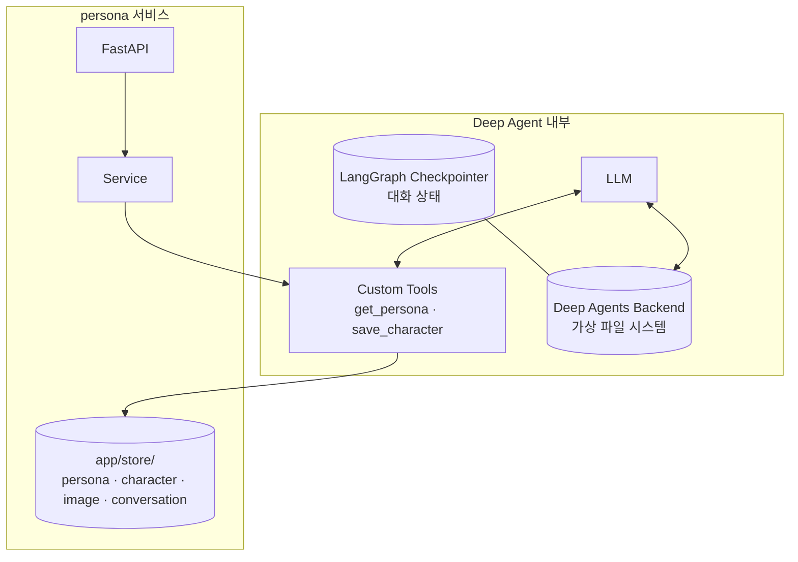
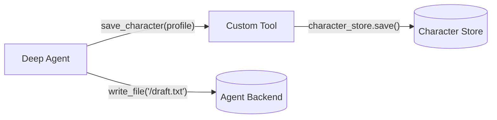
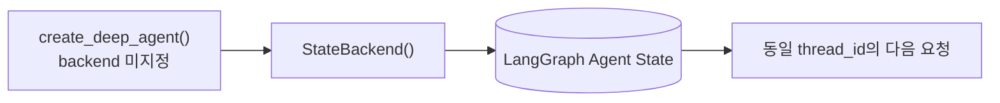
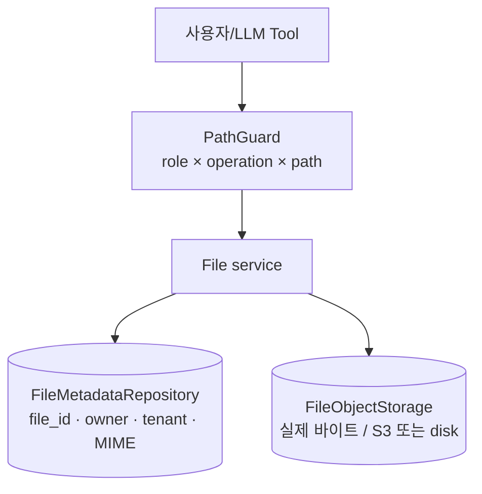
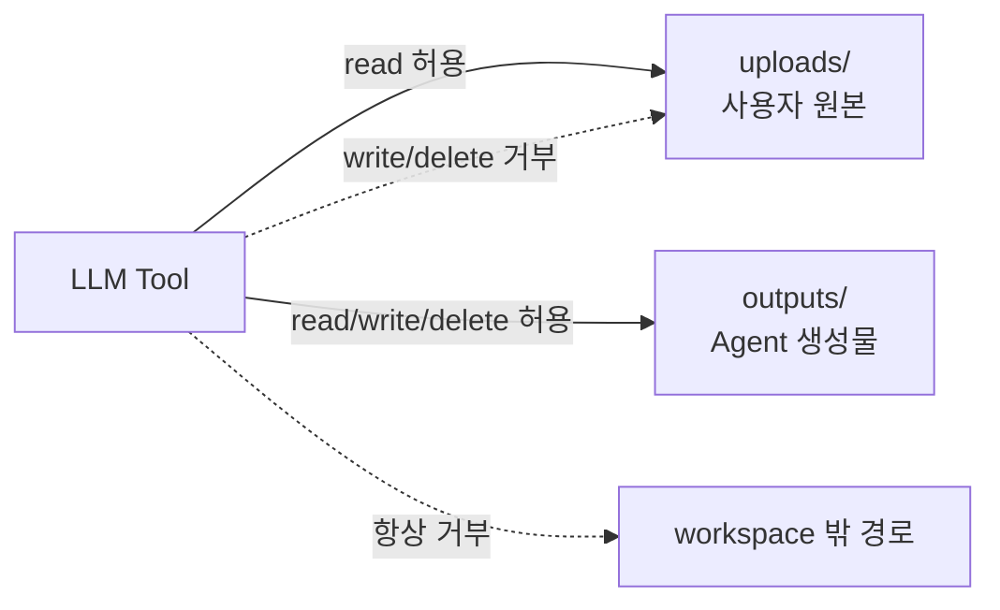
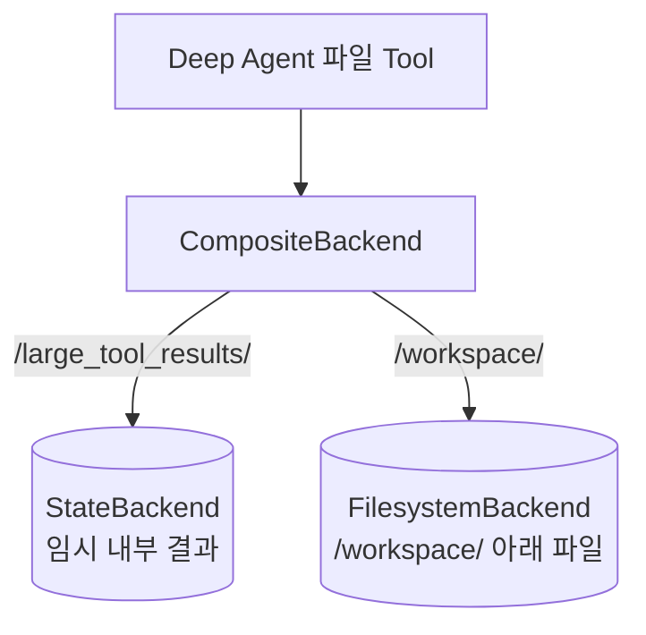

# 02. Backends — 에이전트가 보는 파일 시스템의 저장 위치

> 공식 문서: [Deep Agents — Backends](https://docs.langchain.com/oss/python/deepagents/backends)  
> 학습 프로젝트: 통화 데이터 기반 persona 서비스  
> 확인한 설치 버전: `deepagents==0.6.12`

## 1. 한 문장 정의

Deep Agents의 **backend**는 Agent가 `read_file`, `write_file` 같은 기본 파일 Tool로 접근하는
**가상 파일 시스템의 구현체**다.

이 프로젝트의 `app/store/`와 이름은 비슷하지만 목적과 API가 다르다.

> backend = Agent의 파일 작업 공간  
> `app/store/` = persona 서비스의 정식 비즈니스 데이터 저장소

## 2. Mental model



두 저장 경로는 자동으로 연결되지 않는다.

- Agent가 `save_character(profile)`을 호출하면 Custom Tool이 `character_store.save()`를 호출한다.
- Agent가 `write_file("/draft.txt", ...)`를 호출하면 backend에 파일이 생긴다.
- `write_file()`은 `character_store`에 캐릭터를 만들지 않는다.
- `character_store.save()`는 backend에 파일을 만들지 않는다.



## 3. backend가 처리하는 일

Deep Agents는 Agent에게 기본 파일 Tool을 제공한다. 이 Tool들이 실제로 어디에 읽고 쓸지를 backend가 결정한다.

| Agent가 보는 Tool | backend가 하는 일 |
|---|---|
| `ls` | 파일 목록을 보여줌 |
| `read_file` | 파일 내용을 읽음 |
| `write_file` | 파일을 생성하거나 덮어씀 |
| `edit_file` | 파일의 특정 문자열을 교체 |
| `glob`, `grep` | 파일을 찾거나 내용 검색 |
| `execute` | sandbox 또는 shell backend일 때만 명령 실행 |

이 Tool들은 [Tools 챕터](01_tools.md)의 `save_character` 같은 Custom Tool과 다르다.

| 구분 | Custom Tool | Backend 기반 기본 Tool |
|---|---|---|
| 예 | `get_persona`, `save_character` | `read_file`, `write_file` |
| 작성자 | 이 프로젝트 개발자 | Deep Agents harness |
| 다루는 대상 | 서비스의 도메인 데이터 | Agent가 사용하는 파일 |
| 저장 위치 | `app/store/` 또는 이후 DB | 선택한 backend |

## 4. 현재 프로젝트에는 어떤 backend가 있는가?

[app/agents/persona_agent.py](../app/agents/persona_agent.py)의 세 Agent 팩토리는 `backend=`를 전달하지 않는다.

```python
def character_chat_agent(user_id: str):
    return create_deep_agent(
        model=_model(),
        tools=make_character_tools(user_id),
        system_prompt=prompts.CHARACTER_CHAT_PROMPT,
        checkpointer=CHECKPOINTER,
    )
```

이 경우 Deep Agents의 기본값인 `StateBackend()`가 사용된다.



`StateBackend`의 특징은 다음과 같다.

- 현재 Agent thread의 LangGraph 상태에 파일을 둔다.
- checkpointer가 있으면 같은 `thread_id`의 다음 Agent 턴에서도 이어질 수 있다.
- 다른 `thread_id`와는 파일을 공유하지 않는다.
- 큰 Tool 결과를 잠시 파일로 옮겨 Agent 문맥을 가볍게 만드는 용도로 적합하다.

현재 캐릭터 편집은 다음 thread ID를 쓴다.

```python
config = {"configurable": {"thread_id": f"character-chat:{user_id}"}}
```

따라서 캐릭터 편집 Agent가 파일 Tool을 쓴다면, 개념적으로 `character-chat:u1`과
`character-chat:u2`는 서로 다른 Agent 파일 공간을 가진다.

단, 현재 프로젝트의 핵심 기능은 Custom Tool과 `app/store/`를 쓰며, backend 파일을
정식 데이터 저장소로 사용하지 않는다.

## 5. 이 프로젝트의 저장소들과 비교

| 저장 대상 | 현재 코드 | 접근 방법 | 정식 서비스 데이터인가? |
|---|---|---|---|
| 페르소나 | `persona_store` | `get_persona()` Tool, 서비스 | 예 |
| 캐릭터 | `character_store` | `save_character()` Tool, 서비스 | 예 |
| 캐릭터 이미지 | `image_store` | `character_service` | 예 |
| 대신받기 대화 이력 | `conversation_store` | `answer_turn()` | 예, 짧은 세션 데이터 |
| 캐릭터 편집 메시지 상태 | `CHECKPOINTER` | LangGraph | Agent 대화 상태 |
| Agent 파일 | `StateBackend` 기본값 | 파일 Tool | 아니오, Agent 작업 공간 |

`persona_store`와 `character_store`는 `Protocol`을 통해 `save/get` 계약을 먼저 정의하고,
현재는 인메모리 구현을 사용한다. 운영 환경에서는 RDB 같은 서비스 DB 구현으로 바꾸는 것이 자연스럽다.

반면 backend는 파일 경로(`/draft.txt` 같은 경로)를 중심으로 `read/write/list`를 제공한다.
즉, 사용자 캐릭터를 `user_id`로 조회해야 하는 서비스 저장소를 backend로 기계적으로 대체하면 안 된다.

## 6. 구현 사례 비교 — agent-harness의 사용자 workspace

이 섹션은 [Agent Harness 참고 지도](00_agent_harness_reference.md)를 실제 Backends 주제에 적용한 첫 비교다.
`agent-harness`는 Deep Agents backend를 사용하지 않고 자체 ReAct runtime을 구현한다. 하지만 Agent가 파일을
다루는 제품을 운영할 때 어떤 계층이 필요해지는지 보여주는 좋은 사례다.

### agent-harness가 파일을 분리하는 방식

`agent_harness_interface/files.py`에는 파일 저장을 위한 두 계약이 분리돼 있다.

| 계약 | 책임 | 왜 나눴는가? |
|---|---|---|
| `FileObjectStorage` | S3/로컬 디스크 같은 객체 본문 저장 | 바이트를 실제로 저장·읽기 |
| `FileMetadataRepository` | 파일명, 크기, MIME type, owner, tenant, 삭제 상태 | 소유권·조회·표시·권한을 관리 |



이 구조는 단순히 파일을 저장하는 것보다 더 넓은 제품 요구사항을 다룬다.

- 사용자/테넌트별 소유권
- 업로드 파일과 Agent 생성 파일의 출처(`provenance`)
- 용량 제한과 임시 업로드
- 삭제 상태와 파일 트리 조회
- S3와 로컬 디스크 구현 교체

### PathGuard가 보여주는 권한 경계

`tests/test_workspace_path_guard.py`는 다음을 테스트한다.

- `../etc/passwd` 같은 path traversal 거부
- Agent Tool이 thread workspace 밖의 절대 경로에 접근하는 것 거부
- symlink가 workspace 밖을 가리킬 때 거부
- LLM Tool은 사용자 원본 `uploads/`를 읽을 수 있지만 쓰거나 삭제하지 못함
- 사용자-facing API, LLM Tool, system, memory Tool, MCP Tool마다 다른 경로·작업 권한



이 내용은 다음 **Permissions 챕터**에서 더 깊게 비교한다. Backends 관점에서는
“파일 backend를 고른 뒤에도, 누가 어떤 경로를 어떤 작업으로 접근하는지 별도 정책이 필요하다”는 점이 핵심이다.

### persona와의 비교

| 질문 | persona 현재 구현 | agent-harness 구현 사례 | 현재 persona에 대한 판단 |
|---|---|---|---|
| Agent 임시 파일 | 기본 `StateBackend` | thread workspace와 runtime state | 현재는 `StateBackend`로 충분 |
| 정식 캐릭터 데이터 | `character_store` | metadata repository와 별도 object storage | RDB 전환 시 repository 분리 패턴 참고 |
| 캐릭터 이미지 | `image_store`에 data URI | 파일 본문과 metadata를 분리 | 현재 분리 방향은 유사, 대용량이면 object storage 검토 |
| 사용자 업로드 파일 | 범위 밖 | tenant/owner/provenance를 가진 workspace | 통화 원문 업로드가 생길 때 참고 |
| 파일 경로 보안 | Agent 파일 Tool을 적극 사용하지 않음 | PathGuard와 역할×작업 행렬 | 파일 Tool을 열기 전에 도입 검토 |

현재 `image_store`를 `character_store`와 분리한 설계는, 규모는 다르지만 Agent Harness의
“본문 저장과 메타데이터/도메인 데이터의 책임 분리”와 같은 방향이다.

### 학습 결론과 적용 결론을 분리하기

| 관점 | 결론 |
|---|---|
| 학습 | Agent Harness의 workspace, object storage, metadata, path guard, 테스트 전략을 모두 살펴본다. |
| 지금 구현 | 사용자 파일 workspace 요구사항이 없으므로 그대로 도입하지 않는다. |
| 미래 적용 조건 | 사용자가 통화 파일을 업로드하거나 Agent가 분석 파일을 생성·공유할 때 owner/tenant/provenance/path guard 패턴을 검토한다. |

## 7. 주요 backend 선택지

| Backend | 저장 위치/범위 | 적합한 상황 | 이 프로젝트에서의 판단 |
|---|---|---|---|
| `StateBackend` | 현재 Agent thread 상태 | 임시 메모, 중간 결과 | 현재 기본값으로 적절 |
| `FilesystemBackend` | 실제 디스크 | 로컬 개발용 코딩 Agent | HTTP 서비스에는 부적합 |
| `StoreBackend` | LangGraph 장기 store, thread 간 공유 가능 | Agent 장기 메모·파일 | 추후 Agent 메모용 후보 |
| `CompositeBackend` | 파일 경로마다 다른 backend | 작업 공간과 내부 파일을 분리 | 파일 기반 분석이 필요할 때 |
| `LocalShellBackend` | 실제 디스크 + 호스트 shell | 신뢰된 로컬 개발 | 이 서비스에서 사용하면 안 됨 |
| Sandbox backend | 격리된 파일 시스템 + 명령 실행 | 안전하게 코드 실행이 필요할 때 | Sandboxes 챕터에서 다룸 |

### `FilesystemBackend`를 지금 도입하면 안 되는 이유

이 서비스는 FastAPI HTTP 서버이고 통화 원문 같은 신뢰할 수 없는 입력을 다룬다. 실제 서버 파일 시스템을
Agent에게 연결하면 `.env` 같은 비밀 파일을 읽거나 파일을 영구 수정할 위험이 있다.

공식 문서도 web server/HTTP API에는 `FilesystemBackend` 대신 `StateBackend`, `StoreBackend`,
또는 sandbox backend를 사용하라고 안내한다.

### `StoreBackend`는 언제 고려할까?

Agent가 여러 실행에 걸쳐 다음 같은 파일을 보존해야 할 때다.

- 통화 분석 중에 생성한 장기 메모
- 사람이 검토한 분석 규칙
- 재사용할 도메인 지식 파일

다만 multi-user 환경에서는 namespace를 사용자 또는 테넌트별로 분리해야 한다.

```python
StoreBackend(
    namespace=lambda runtime: (runtime.context["user_id"],)
)
```

이 예시는 **Agent 파일 공간**을 사용자별로 분리하는 예시다. API 인증·인가나 `character_store`의
정식 데이터 격리를 대신하지는 않는다.

## 8. `CompositeBackend`의 핵심 아이디어

하나의 Agent 파일 시스템에서도 경로별로 저장 위치를 나눌 수 있다.



파일 기반 분석이나 개발 Agent에서는 유용하다. 하지만 현재 persona 서비스는 Agent가 프로젝트 파일이나
통화 파일을 직접 읽어야 하는 요구사항이 없으므로 아직 도입할 이유가 없다.

## 9. 설계 판단

### 현재 결론 — 코드 변경 없음

`StateBackend` 기본값을 유지한다.

- Agent 파일 Tool이 현재 핵심 기능이 아니다.
- 페르소나·캐릭터는 `app/store/`의 도메인 계약으로 충분히 분리돼 있다.
- 실제 파일 시스템이나 shell을 노출하면 이 서비스에서는 보안 위험이 커진다.

### 나중에 검토할 변화

| 요구사항 변화 | 검토할 선택 |
|---|---|
| 대용량 통화 기록을 Agent가 파일로 나눠 분석 | `StateBackend` 또는 sandbox backend |
| 여러 실행에 걸친 Agent 분석 메모 | 사용자 namespace를 둔 `StoreBackend` |
| 개발용 Agent가 프로젝트 파일을 편집 | `CompositeBackend` + `FilesystemBackend(virtual_mode=True)` |
| Agent가 코드/명령을 실행 | production에서는 sandbox backend |

## 10. Python과 구조 읽기

### 키워드 인자

```python
create_deep_agent(model=_model(), checkpointer=CHECKPOINTER)
```

`model=`과 `checkpointer=`는 **키워드 인자**다. 함수에 어떤 값을 전달하는지 이름으로 드러나므로,
Agent 설정처럼 인자가 많은 함수에서 읽기 좋다.

### `Protocol`과 구현체

```python
class CharacterStore(Protocol):
    def save(self, character: Character) -> None: ...
    def get(self, user_id: str) -> Character | None: ...
```

`Protocol`은 “이 저장소라면 이 메서드를 제공해야 한다”는 약속이다. 현재는
`InMemoryCharacterStore`가 이 약속을 구현한다. 나중에 DB 저장소로 교체해도 서비스와 Tool은
`save/get`만 알고 있으면 되므로 영향이 작아진다.

이 구조는 Deep Agents의 `BackendProtocol`과 비슷한 설계 철학을 가진다. 다만 전자는 Agent 파일 시스템,
후자는 이 서비스의 도메인 데이터를 위한 서로 다른 계약이다.

## 11. 핵심 정리

- backend는 Deep Agents의 파일 Tool이 사용할 저장소다.
- 현재 `backend=`를 지정하지 않은 Agent는 `StateBackend` 기본값을 사용한다.
- `StateBackend` 파일은 Agent thread와 checkpointer에 연결되며, 서비스 저장소와 다르다.
- `app/store/`는 persona 서비스의 정식 비즈니스 데이터를 저장한다.
- `FilesystemBackend`와 `LocalShellBackend`를 HTTP 서비스에 연결하지 않는다.
- 장기 Agent 파일이 필요할 때는 `StoreBackend`와 사용자별 namespace를 검토한다.
- 현재 프로젝트에는 backend 변경보다 도메인 저장소 영속화가 먼저다.
- agent-harness는 파일 workspace를 제품 기능으로 만들 때 필요한 storage·metadata·path guard 분리 사례다.

## 12. 이해 확인

다음 두 동작은 어디에 저장될까?

1. Agent가 `save_character(profile)` Tool을 호출한다.
2. Agent가 `write_file("/analysis.txt", "...")` 기본 Tool을 호출한다.

추가 질문: `character-chat:u1`과 `character-chat:u2`가 서로 다른 thread ID라면,
`StateBackend`에 쓴 파일을 서로 공유할 수 있을까?

## 다음 주제

다음은 **03. Permissions**다. Agent의 파일 Tool에 어떤 경로를 읽고 쓸 수 있게 할지,
그리고 `.env` 같은 비밀 파일을 왜 별도 경계로 보호해야 하는지 살펴본다.
