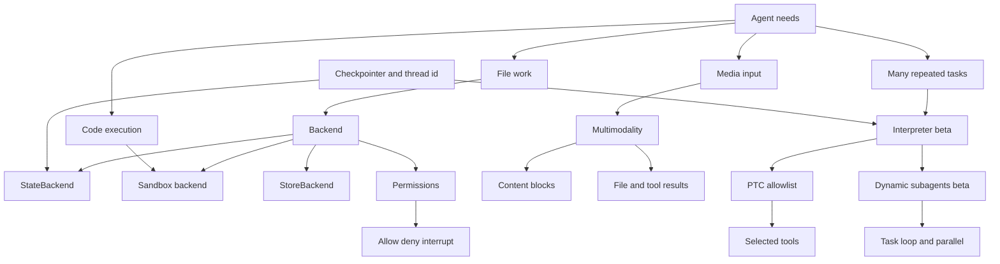
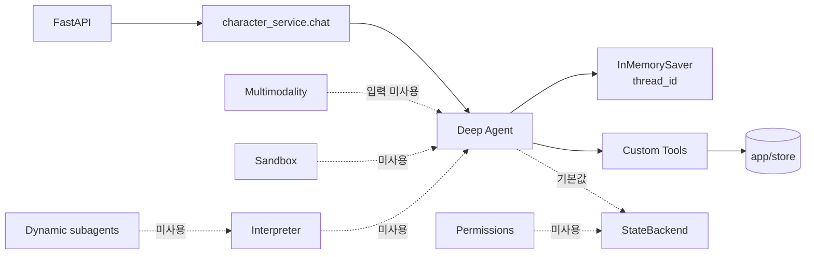

# 03–07 개념 연결 지도 — “무엇을 하려는가?”로 고르는 실행 환경

> 이 지도는 현재 persona POC의 범위와 앞으로 학습할 기능을 한 화면에 연결한다.

## 가장 헷갈리기 쉬운 연결

| A | B와의 관계 | 아닌 것 |
|---|---|---|
| Permissions | Backend의 **기본 파일 Tool** 접근을 경로별 통제 | 모든 Custom Tool의 권한 시스템 |
| Multimodality | 메시지/Tool 결과에 media content block을 전달 | STT, OCR, 이미지 생성을 자동 제공하는 기능 |
| Sandbox | 격리 환경에서 파일·shell·코드 실행 | 단순한 StateBackend 또는 Checkpointer |
| Interpreter | 메모리 안에서 Tool 흐름을 code로 반복·집계 | OS shell, 패키지 설치, host file 조작 |
| Dynamic subagents | Interpreter가 `task()`로 여러 subagent를 orchestration | 일반 subagent의 다른 이름 |
| Checkpointer | 동일 `thread_id`의 graph state snapshot 복원 | StoreBackend나 Sandbox 자체 |

## 현재 persona POC에 실제로 연결된 선

## 선택 순서

1. **데이터를 어디에 둘까?** → Backend / `app/store` / Checkpointer를 먼저 구분한다.
2. **Agent가 파일을 만질까?** → 그렇다면 Permissions를 함께 설계한다.
3. **텍스트만으로 부족한가?** → Multimodality와 모델 지원 범위를 확인한다.
4. **코드를 실행해야 하는가?** → 그렇다면 Sandbox다.
5. **수십·수백 작업을 결정적으로 반복/집계해야 하는가?** → Interpreter, 이후 Dynamic subagents를 검토한다.

현재 POC의 다음 자연스러운 학습 순서는 Event streaming(08)이다. 기존 `StreamingResponse`와 Deep Agents event stream의 경계를 비교하기 좋다.
