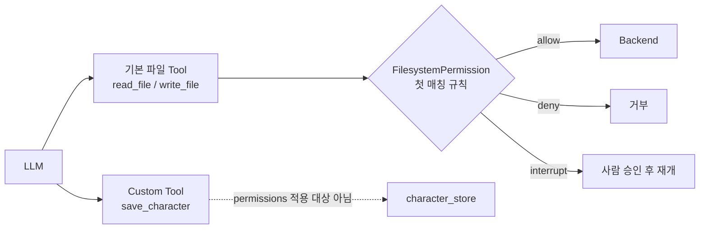
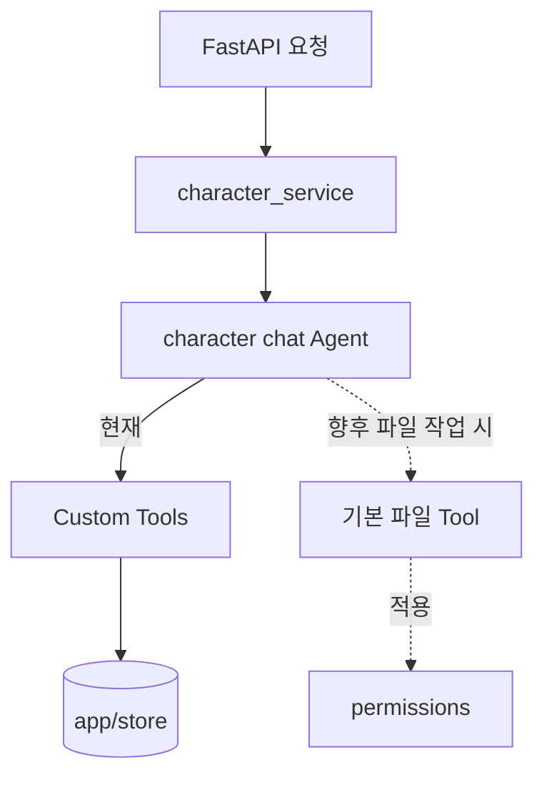

# 03. Permissions — Agent 파일 Tool의 경로별 출입 규칙

> 공식 문서: [Deep Agents — Permissions](https://docs.langchain.com/oss/python/deepagents/permissions)  
> 현재 상태: **미사용** — 기본 `StateBackend` 파일 Tool도 적극 사용하지 않는다.

## 핵심 한 줄

`permissions=`는 Agent의 **기본 파일 Tool**이 어느 경로를 읽거나 쓸 수 있는지 정하는 규칙이다.
`save_character()` 같은 Custom Tool의 권한을 대신 관리하지는 않는다.



## 규칙 읽는 법

| 요소 | 뜻 |
|---|---|
| `operations` | `read`(`ls`, `read_file`, `glob`, `grep`) 또는 `write`(`write_file`, `edit_file`, `delete`) |
| `paths` | `/workspace/**` 같은 glob 경로 |
| `mode` | `allow`, `deny`, `interrupt` |
| 평가 순서 | **위에서부터 첫 번째 매칭 규칙이 승리**. 일치하지 않으면 허용이 기본값 |

```python
FilesystemPermission(operations=["read", "write"], paths=["/workspace/.env"], mode="deny"),
FilesystemPermission(operations=["read", "write"], paths=["/workspace/**"], mode="allow"),
FilesystemPermission(operations=["read", "write"], paths=["/**"], mode="deny"),
```

구체적인 deny를 넓은 allow보다 **먼저** 두어야 한다.

## persona에 연결하면



- `app/agents/tools.py`의 `make_character_tools(user_id)`는 `user_id`를 서버에서 묶는다. 이것은 파일 권한이 아니라 **도메인 대상 선택/인가 경계**다.
- 캐릭터 저장은 `character_store`로 직접 간다. `FilesystemPermission`으로 이를 막을 수 없다.
- 통화 원문을 Agent 파일로 다루기 시작한다면 `/uploads/**` 읽기와 `/outputs/**` 쓰기를 분리하는 규칙을 먼저 설계한다.

## `interrupt`와 Checkpointer

`mode="interrupt"`는 쓰기 전에 Agent를 멈추고 승인·수정·거절을 받는다. 중단 후 이어서 실행해야 하므로 **checkpointer가 필요**하다. 현재 `factory.CHECKPOINTER`는 캐릭터 편집 대화에 이미 존재하지만, 파일 권한 규칙 자체는 아직 연결하지 않았다.

## 적용 판단

| 분류 | 판단 |
|---|---|
| 설명만 | 현재 구조에서는 충분히 학습할 가치가 있다. |
| 작은 실습 | `StateBackend`의 `/drafts/**`만 쓰도록 allow + 나머지 deny 테스트 작성 |
| 지금 제품 도입 | 파일 Tool을 실제 기능에 사용하기 전까지 보류 |

### agent-harness에서 볼 점

`agent-harness/userspace/path_guard.py`는 Tool 주체별로 경로와 작업을 검사한다. Deep Agents Permissions는 그중 **기본 파일 Tool의 경로 규칙**에 해당하는 작은 범위다.

> 주의: Sandbox의 `execute`, Custom Tool, MCP Tool에는 이 규칙이 자동 적용되지 않는다. 그런 동작은 Custom Tool 내부 검증 또는 backend policy hook으로 통제한다.
