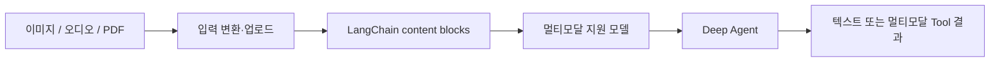
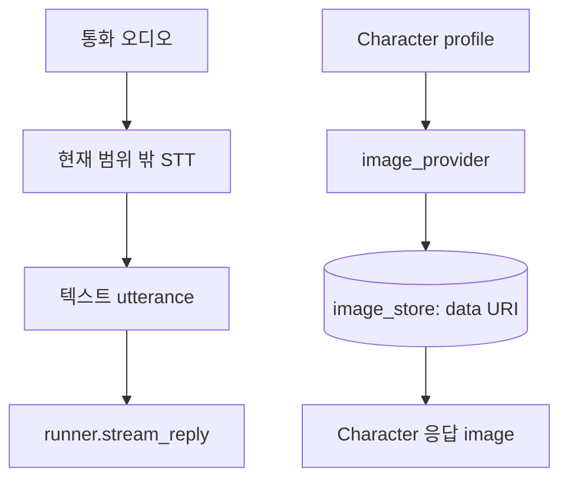

# 04. Multimodality — 텍스트 외 입력·출력을 Agent 문맥에 넣는 방법

> 공식 문서: [Deep Agents — Multimodal inputs and outputs](https://docs.langchain.com/oss/python/deepagents/multimodal)  
> 현재 상태: 캐릭터 **이미지 생성·반환은 있음**, Deep Agent 입력은 현재 텍스트 중심이다.

## 핵심 한 줄

Multimodality는 이미지·오디오·영상·문서를 **LLM이 이해할 수 있는 content block**으로 메시지나 Tool 결과에 넣는 것이다. Agent 자체가 STT나 이미지 생성기를 자동으로 제공한다는 뜻은 아니다.



## 현재 persona의 위치



- `runner.stream_reply()`는 텍스트 메시지로 모델을 직접 스트리밍한다.
- `character_service.py`는 프로필에서 이미지를 **생성**하지만, 그 이미지를 Agent가 다시 보고 판단하게 하지는 않는다.
- 따라서 “이미지 기능이 있다”와 “멀티모달 Agent다”는 다른 말이다.

## Agent에 미디어를 넣는 세 가지 길

| 길 | 예 | 모델이 받는 것 |
|---|---|---|
| 사용자 메시지 | 통화 화면 스크린샷 | `text` + `image` content block |
| 기본 `read_file` | backend의 `.png`, `.mp3`, `.pdf` | 파일을 읽은 멀티모달 Tool 결과 |
| Custom Tool 결과 | 음성 분석 Tool이 만든 파형/이미지 | text + image/file block |

## 큰 미디어의 원칙

```text
작은 설명·URL·파일 경로  →  메시지에 전달  →  필요할 때만 Agent가 읽기
거대한 base64 이미지      →  매 turn 메시지에 중복  →  문맥·비용 증가
```

문서의 요지는 “큰 이미지/오디오는 backend나 object storage에 두고, 메시지에는 경로나 URL을 우선 전달”이다. 오래된 대화가 요약되면 미디어 block은 텍스트 요약으로 대체되어 사라질 수 있다.

## 적용 판단

| 분류 | 판단 |
|---|---|
| 설명만 | 지금 이미지 생성 경로와 모델 입력 경로를 구분할 수 있으면 된다. |
| 작은 실습 | 이미지 URL이 든 content block을 받는 가짜 모델 테스트 |
| 제품 후보 | STT 원문과 함께 “통화 화면/문서”를 분석해야 할 요구가 생길 때 |

### agent-harness에서 볼 점

`agent-harness`는 vision model과 `analyze_image` Tool을 별도 경계로 둔다. persona도 미디어 입력이 필요해지면 “업로드/저장 → 분석 Tool → 텍스트 사실” 경계를 먼저 만들고, 모든 이미지를 대화 메시지에 넣지 않는다.
