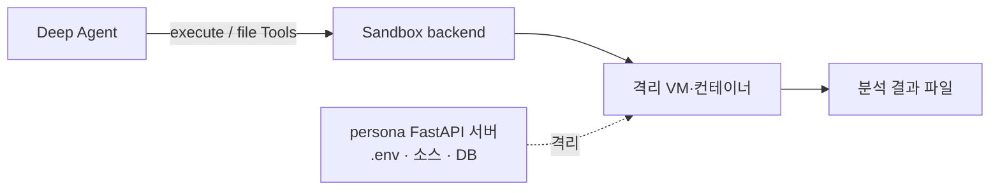
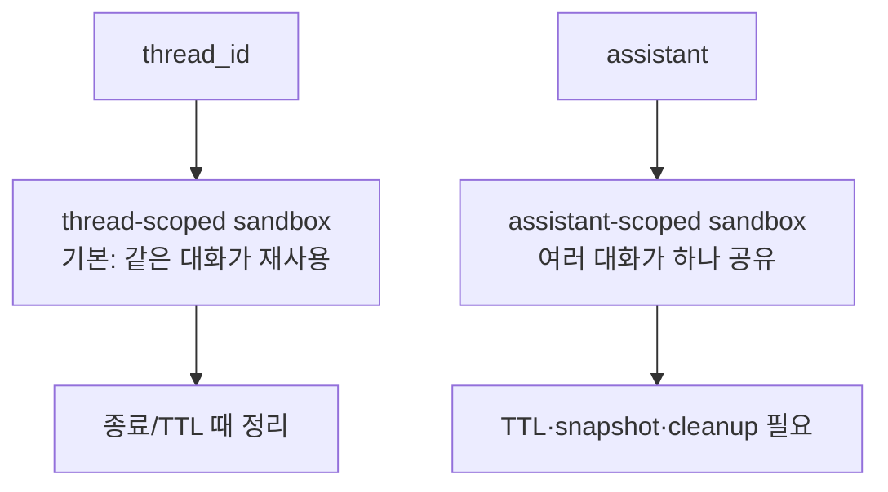

# 05. Sandboxes — Agent가 코드를 실행해도 호스트를 건드리지 않게 하는 격리 환경

> 공식 문서: [Deep Agents — Sandboxes](https://docs.langchain.com/oss/python/deepagents/sandboxes)  
> 현재 상태: **미사용** — 이 서비스는 Agent 코드 실행 기능이 없다.

## 핵심 한 줄

Sandbox는 Deep Agents의 한 종류의 backend로, Agent에게 파일 Tool뿐 아니라 `execute`를 제공하되 **호스트 대신 격리된 환경**에서 실행하게 한다.

## Backend / Sandbox / Interpreter를 혼동하지 않기

| 필요 | 선택 | 할 수 있는 일 |
|---|---|---|
| 임시 파일 | `StateBackend` | Agent 파일 읽기·쓰기, shell 실행 없음 |
| 실제 호스트 파일 | `FilesystemBackend` | 로컬 파일 접근 — HTTP 서버에는 위험 |
| 코드·shell 실행 | **Sandbox** | 격리 환경에서 `execute`, 패키지 설치, 테스트 |
| 메모리 안의 정리·반복 | Interpreter | OS나 shell에 접근하지 않음 |

## sandbox의 수명 범위

Sandbox도 비용·디스크·패키지 상태를 가진 자원이다. 체크포인터와 다르게, sandbox는 외부 실행 환경 자체다. checkpoint를 되돌려도 이미 실행된 명령의 부작용이 자동으로 되돌아가지는 않는다.

## persona에 연결하면

현재 통화 데이터 기반 persona 생성은 모델과 Custom Tool만으로 충분하다. Sandbox가 적합해지는 예는 다음처럼 **코드 실행이 실제 문제 해결 수단**일 때다.

- 업로드한 대량 CSV 통화 로그를 pandas로 집계
- Agent가 생성한 분석 스크립트를 실행하고 그래프 파일 산출
- 격리된 환경에서 음성 파일 변환/분석

그 전에는 Sandbox를 넣어도 복잡성·비용만 늘어난다. 특히 현재 FastAPI 프로세스에 `LocalShellBackend`를 연결하는 것은 Sandbox가 아니다. 그것은 호스트 shell을 직접 여는 것이므로 사용하지 않는다.

### agent-harness에서 볼 점

`agent-harness/sandbox/`는 Python·shell·JavaScript 실행을 별도 계층으로 다룬다. 이 구조는 “코드 실행이 제품 요구일 때 필요한 수명 관리·정리·권한”을 학습하는 참고 사례다.
