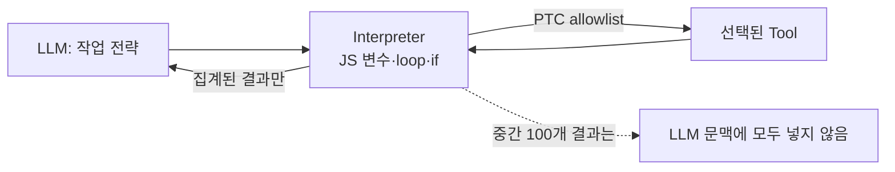
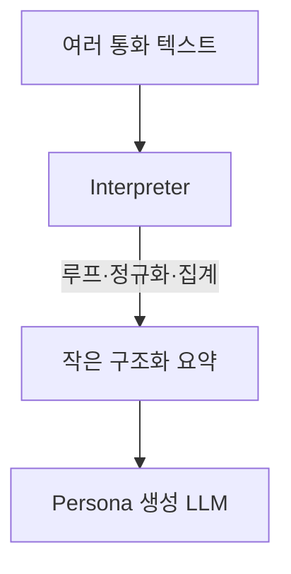

# 06. Interpreters — LLM 대신 짧은 코드가 Tool 흐름을 반복·정리하는 내부 작업대

> 공식 문서: [Deep Agents — Interpreters](https://docs.langchain.com/oss/python/deepagents/interpreters)  
> 상태: **Beta**, `langchain-quickjs>=0.2.0`, Python 3.11 이상 필요. 현재 미사용.

## 핵심 한 줄

Interpreter는 Agent loop 안의 **인메모리 JavaScript 작업대**다. LLM이 매 단계 Tool을 하나씩 결정하는 대신, LLM이 작성한 짧은 코드가 반복·분기·집계하고 **필요한 최종 결과만** LLM에게 돌려준다.



## 일반 Tool 호출과 차이

```text
일반: LLM → Tool 1개 → 결과 → LLM → Tool 1개 → 결과
해석기: LLM → JS loop → Tool 100개 호출·필터·집계 → 요약 1개 → LLM
```

Programmatic Tool Calling(PTC)을 켜면 allowlist에 든 Tool만 interpreter 코드에서 `tools.someTool(...)`로 호출할 수 있다. 이때 Tool 결과마다 모델 문맥을 채우지 않아, 대량의 결정적 변환·집계에 유리하다.

## persona에 연결하면

| 작업 | Interpreter가 맞나? | 이유 |
|---|---|---|
| 캐릭터 인사말 1개 수정 | 아니오 | 현재 Custom Tool 한 번이면 충분 |
| 통화 턴 스트리밍 | 아니오 | `stream_reply()`가 모델을 직접 호출 |
| 1,000개 통화 발화를 규칙으로 분류·집계 | 후보 | 반복/그룹화/검증 결과만 모델에 전달 가능 |
| pandas 설치·파일 변환 | 아니오, Sandbox | OS·패키지·실행 환경이 필요 |



## 상태·안전에서 기억할 점

- 기본 `mode="thread"`에서는 interpreter 변수도 thread 단위로 이어질 수 있다.
- Checkpointer가 있으면 interpreter snapshot도 graph state에 포함된다. Tool의 외부 부작용을 되돌리지는 못한다.
- PTC 호출은 일반 Tool 호출 경로와 다르므로, 일반 `interrupt_on` 승인 흐름이 호출마다 적용되지 않는다. PTC는 꼭 필요한 Tool만 allowlist에 넣는다.

### agent-harness에서 볼 점

참고 프로젝트의 executor는 Python 코드로 ReAct loop·Tool 실행을 직접 조립한다. Interpreter는 그 모든 harness를 재작성하는 기능이 아니라, **한 Agent 실행 안에서 반복/집계를 코드로 옮기는 Deep Agents 기능**이다.
