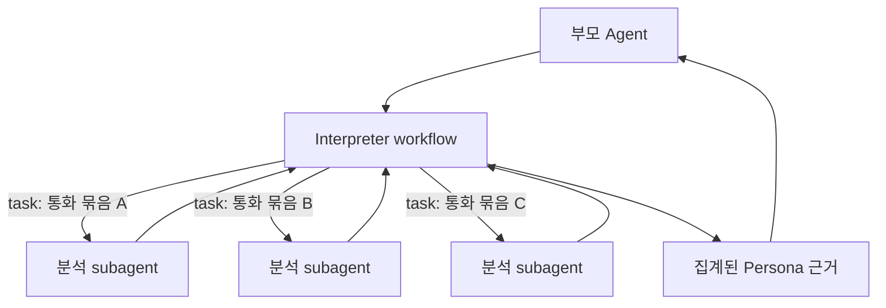

# 07. Dynamic subagents — 코드가 여러 하위 Agent를 반복·병렬로 부르는 방식

> 공식 문서: [Deep Agents — Dynamic subagents](https://docs.langchain.com/oss/python/deepagents/dynamic-subagents)  
> 상태: Interpreter 기반 **Beta** 기능, 현재 미사용.

## 핵심 한 줄

Dynamic subagents는 부모 LLM이 매번 “다음 하위 Agent를 부를까?” 결정하는 대신, Interpreter 코드의 `task()`가 여러 작업 단위를 반복·병렬로 하위 Agent에 맡기는 방식이다.



## 일반 Subagent와의 차이

| 방식 | 누가 몇 번 호출할지 결정하나 | 적합한 일 |
|---|---|---|
| 일반 Subagent | LLM이 Tool처럼 한 번씩 선택 | “관계 분석가에게 이 통화 요약을 검토해줘” |
| Dynamic subagents | Interpreter 코드의 loop/병렬 batch | 모든 통화 묶음, 여러 관점, 재귀적 검증 |

필수 연결고리:

```text
subagents 설정 + CodeInterpreterMiddleware
        ↓
Interpreter의 task() global
        ↓
반복·병렬 dispatch + 결과 합성
```

## persona 예시

```text
통화가 3개뿐:        부모 Agent 하나가 분석 → 충분
통화가 1,000개:      묶음별 말투/관계/일정 신호 분석 → 결과 집계 → 후보
민감한 결론 검증:     analyzer가 후보 생성 → verifier가 독립 재검토 → 후보
```

현재 서비스는 `build_persona_agent()`가 하나의 구조화 출력 `PersonaProfile`을 만들며, subagent나 interpreter를 설정하지 않았다. POC에서 이를 바로 넣으면 비용·지연·추적할 흐름이 늘어나므로, “통화 묶음이 많아 단일 Agent 문맥에 넣기 어려운가?”가 먼저 판단 기준이다.

## 권한과 안전

- Subagent는 기본적으로 부모의 permissions를 상속하지만, spec에 별도 permissions를 주면 부모 규칙을 **대체**한다.
- Dynamic dispatch의 `task()`는 일반 Tool 호출 경로를 거치지 않는다. 하위 작업 시작 전 승인이 필요하면 `eval`/interpreter 실행 자체를 승인 경계로 둔다.
- `task()`에 `responseSchema`를 주면 각 하위 Agent 결과를 일정한 구조로 모아 집계하기 좋다.

### agent-harness에서 볼 점

`agent_harness/agent/executor.py`는 별도 executor와 `SubAgentSpec`으로 하위 실행·권한·이벤트를 관리한다. Deep Agents Dynamic subagents는 같은 문제를 Interpreter의 `task()`로 푸는 방식이며, 현재 persona에는 아직 규모상 필요하지 않다.
