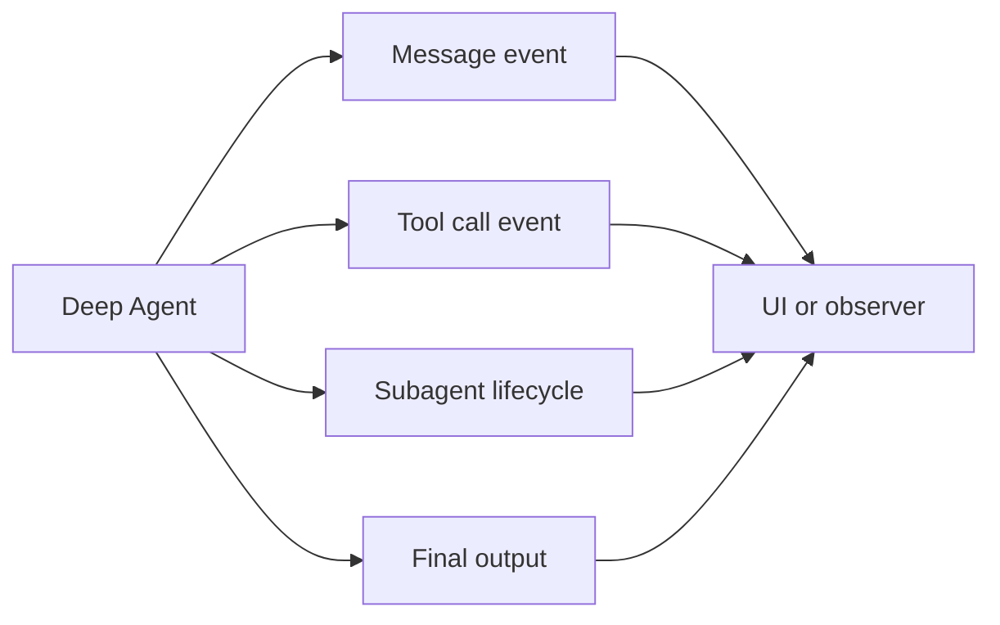
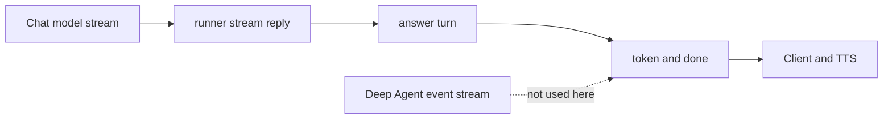

# 08. Event streaming — Agent 내부 작업의 진행 상황을 구조적으로 관찰하기

> 공식 문서: [Deep Agents — Event streaming](https://docs.langchain.com/oss/python/deepagents/event-streaming)  
> 상태: Deep Agents Event streaming은 **Beta**. 현재 대신받기 SSE는 사용 중이지만, Deep Agent event stream은 미사용.

## 핵심 한 줄

Event streaming은 사용자에게 답변 텍스트만 보내는 기능이 아니라, **Agent가 어떤 메시지·Tool·subagent 작업을 진행 중인지** 구조화된 이벤트로 관찰하는 기능이다.



## 현재 SSE와의 차이



현재 `/personas/{user_id}/answer-context`의 이벤트는 다음 두 개다.

| 이벤트 | 데이터 | 의미 |
|---|---|---|
| `token` | `{ "delta": "..." }` | 모델이 만든 응답 텍스트 조각. 모델 내부 tokenizer와 반드시 1:1은 아님 |
| `done` | `{ "call_id": "...", "reply": "..." }` | 모든 조각을 합친 최종 응답 |

`app/agents/runner.py`의 `stream_reply()`는 Deep Agent가 아니라 채팅 모델의 `.stream(messages)`를 직접 호출한다. `app/services/persona_service.py`가 그 조각을 `token` SSE로 바꾸고, 마지막에 `done`을 보낸다.

## Deep Agents Event streaming에서 보는 것

```text
subagent started
tool call started: get_persona
tool call completed: get_persona
tool call started: save_character
tool call completed: save_character
subagent completed
final output
```

공식 API의 `agent.stream_events(..., version="v3")`는 다음 projection을 제공한다.

| projection | 관찰 대상 |
|---|---|
| `stream.messages` | coordinator Agent의 메시지 |
| `stream.tool_calls` | coordinator Tool 호출과 결과 |
| `stream.subagents` | delegated `task`별 하위 Agent handle |
| `subagent.messages` | 특정 subagent 메시지 |
| `subagent.tool_calls` | 특정 subagent Tool 호출 |
| `subagent.status` | started / completed / failed / interrupted |

여러 subagent가 동시에 실행되면 이벤트가 섞일 수 있다. Event streaming은 subagent 이름과 path/namespace를 제공해 UI가 각 작업의 진행 상태를 나눠 보여줄 수 있게 한다.

## 언제 쓰는가

| 상황 | 더 알맞은 방식 |
|---|---|
| 대신받기 문장을 가능한 빨리 TTS로 보냄 | 현재처럼 모델 텍스트 stream + 간단한 SSE |
| 캐릭터 편집 중 Tool이 무엇을 했는지 개발자 화면에 표시 | Event streaming 후보 |
| 여러 통화 묶음을 subagent가 분석하는 진행 UI | Event streaming 적합 |
| 최종 결과만 필요 | 일반 `invoke()` |

현재 캐릭터 편집은 `runner.invoke_text()`로 한 번에 결과를 받으므로 Tool 진행 상황을 밖으로 노출하지 않는다. 지금 제품 기능에는 유지하는 편이 단순하다.

## 09 Streaming과의 연결

```text
09 Streaming = 어떤 단위의 결과를 언제 내보낼까?
08 Event streaming = Agent 내부의 어떤 종류의 일을 관찰할까?
```

다음 장에서는 모델 `.stream()`, Deep Agent `stream()`, FastAPI SSE라는 세 층을 분리한다.
