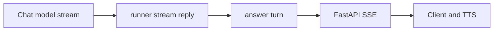
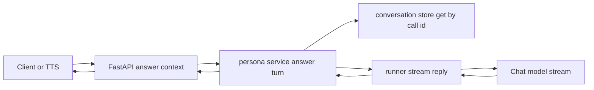
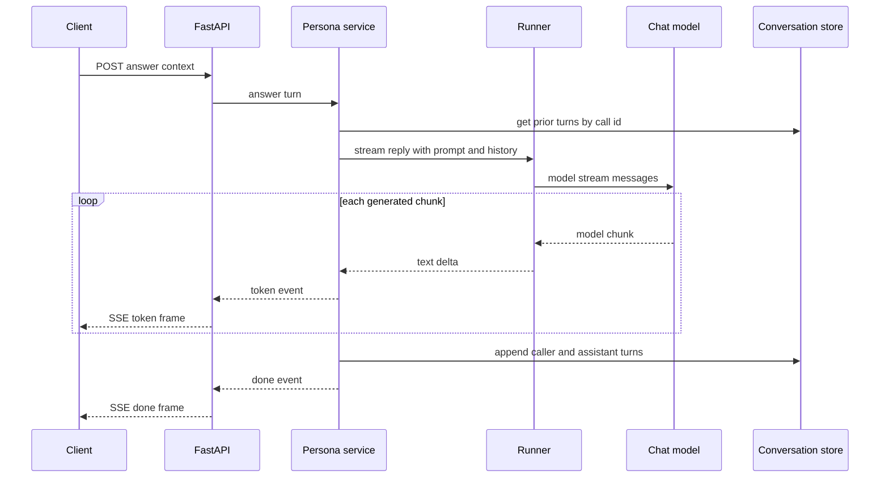
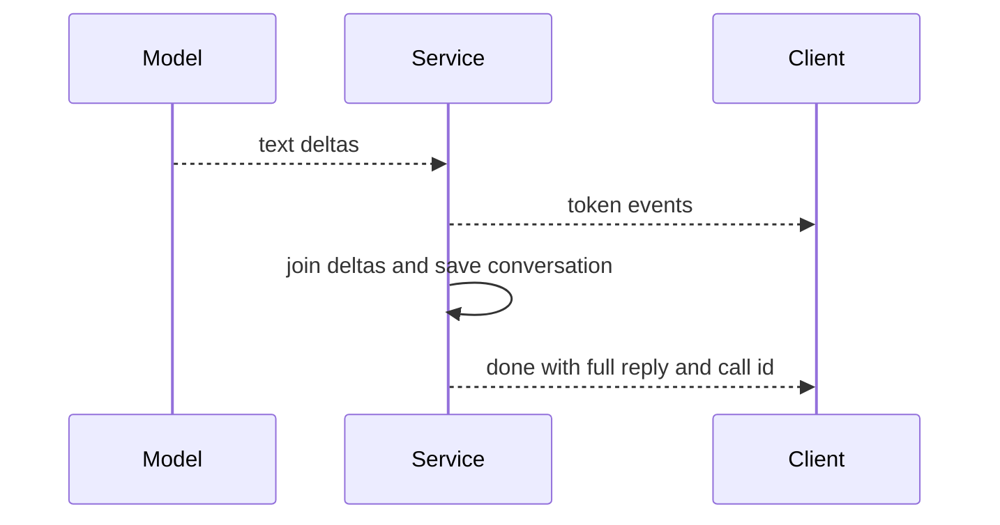
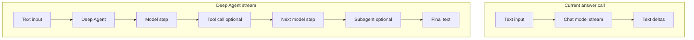
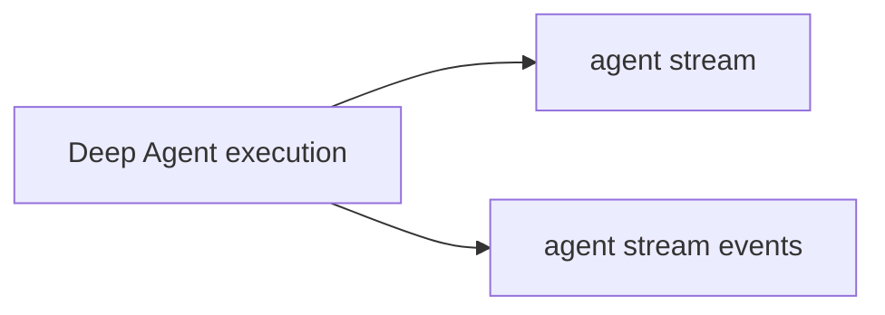

# 09. Streaming — 응답을 끝까지 기다리지 않고 조각으로 전달하기

> 공식 문서: [Deep Agents — Streaming](https://docs.langchain.com/oss/python/deepagents/streaming)  
> 현재 상태: 대신받기 응답에 모델 직접 stream + SSE를 사용한다. Deep Agent stream은 미사용.

## 핵심 한 줄

Streaming은 결과를 한 번에 반환하지 않고 **도착하는 조각을 즉시 전달**하는 방식이다. 현재 프로젝트에서는 모델 조각을 `token` SSE로 바꿔 클라이언트/TTS에 전달한다.



## 현재 코드의 세 층

| 층 | 코드 | 내보내는 것 |
|---|---|---|
| 모델 | `build_model().stream(messages)` | 모델 응답 chunk |
| 앱 로직 | `runner.stream_reply()` | 텍스트 delta |
| HTTP 전송 | `StreamingResponse`와 `_sse()` | `event: token`, `event: done` |

```text
model chunk:  "확인" → "해볼" → "게요"
SSE token:    {"delta": "확인"} → ...
SSE done:     {"reply": "확인해볼게요"}
```

`token`은 모델 내부 tokenizer와 반드시 1:1인 단위가 아니다. 현재 코드가 받은 모델 chunk에서 텍스트를 추출한 조각이다.

## 실제 실행 흐름: Deep Agent가 아닌 모델 직접 stream

현재 `/personas/{user_id}/answer-context` 요청은 다음 세 단계를 지난다.





코드에서 이 경계를 확인할 수 있다.

| 단계 | 코드 | 하는 일 |
|---|---|---|
| 1 | `runner.stream_reply()` | system prompt, 통화 이력, 새 발화를 `messages`로 조립 |
| 2 | `build_model().stream(messages)` | 모델이 만든 chunk를 직접 하나씩 받음 |
| 3 | `answer_turn()` | chunk를 `("token", {"delta": ...})`로 변환하고 전체 답변을 합침 |
| 4 | `StreamingResponse`와 `_sse()` | 앱 이벤트를 HTTP SSE 프레임으로 전송 |

```text
Model stream       = 모델에서 서버로 오는 텍스트 조각
Service generator  = 조각을 token and done 앱 이벤트로 바꿈
SSE                = 앱 이벤트를 클라이언트와 TTS로 보내는 HTTP 형식
```

`conversation_store`는 모델 호출 전 이력을 제공하고, 모델이 끝난 뒤 새 발화와 완성된 응답을 저장한다. 이는 통화 문맥 관리이며, 이 흐름에는 Deep Agent나 Checkpointer가 참여하지 않는다.

## 왜 `done`이 필요한가



`done`은 “마지막 text 조각” 이상이다. 현재 `answer_turn()`에서는 모든 delta를 합치고, `conversation_store`에 다음 턴용 이력을 저장한 뒤 `done`을 보낸다.

| 이벤트 | 클라이언트 역할 |
|---|---|
| `token` | 즉시 자막 표시 또는 TTS 전달 |
| `done` | 로딩 종료, 완성된 reply 확정, `call_id` 확인 |
| `error` | 향후 추가 가능한 실패 계약 |

## 모델 stream과 Deep Agent stream의 차이



Deep Agent stream은 final text뿐 아니라 model 메시지, Tool 호출과 결과, subagent 진행 상태 같은 **Agent 실행 과정**을 내보낼 수 있다. 반대로 현재 흐름은 모델의 텍스트 조각만 받아 TTS로 빠르게 보낸다.

| 구분 | 현재 대신받기 | Deep Agent stream |
|---|---|---|
| 호출 대상 | `ChatModel.stream()` | `agent.stream()` 또는 Event streaming |
| Tool loop | 없음 | 있을 수 있음 |
| Subagent | 없음 | 있을 수 있음 |
| 외부 이벤트 | `token`, `done` | 메시지, Tool, subagent, 상태, 최종 출력 |
| 주 목적 | TTS 응답 지연 감소 | 복잡한 Agent 실행 과정 관찰 |

대신받기는 짧은 응답 하나를 빨리 TTS로 보내는 흐름이므로, `runner.stream_reply()`가 모델을 직접 호출하는 현재 설계가 적합하다. 캐릭터 편집이나 대규모 분석처럼 Tool loop·subagent의 진행을 UI에 보이고 싶을 때 Deep Agent stream이 후보가 된다.

## `agent.stream()`과 `agent.stream_events()`

둘 다 **Deep Agent 실행을 스트리밍**한다. 차이는 같은 실행 과정을 받는 인터페이스다.



| API | 비유 | 받는 방식 |
|---|---|---|
| `agent.stream()` | 하나의 큰 이벤트 채널 | 하나의 iterator에서 chunk를 받고 `stream_mode`별로 직접 분기 |
| `agent.stream_events()` | 목적별로 나뉜 이벤트 채널 | 메시지·Tool·subagent·값처럼 관심 있는 projection을 분리해 소비 |

```text
agent.stream()
  = 한 채널에서 받은 chunk를 보고
    token인지, tool update인지 애플리케이션이 판별한다.

agent.stream_events()
  = token, tool, subagent 등의 관심사를 나눈
    typed event stream을 받는다.
```

둘 다 모델 token뿐 아니라 Tool 호출과 결과, subagent 진행 상태처럼 Agent loop 내부 이벤트를 볼 수 있다. Deep Agents 최신 문서는 새 Agent 앱에서는 typed Event streaming API를 우선 권장한다.

현재 프로젝트의 `build_model().stream(messages)`는 이 둘과 다르다. Deep Agent가 아니라 **모델 객체만** 스트리밍하므로, Tool·subagent 이벤트는 발생하지도 않고 받을 수도 없다.

## 08 Event streaming과의 관계

| 질문 | Streaming | Event streaming |
|---|---|---|
| 무엇을 빨리 보내나? | 텍스트 chunk 또는 상태 update | 메시지·Tool·subagent 등 구조화 이벤트 |
| 현재 대신받기 | `token`/`done` SSE | 사용하지 않음 |
| 주 목적 | 사용자 반응 속도 | Agent 진행 관찰/복잡한 UI |

Deep Agents 최신 문서는 새 Agent 앱에서 typed Event streaming API를 우선 권장한다. 현재 직접 모델 stream을 바꿔야 한다는 뜻은 아니다.
