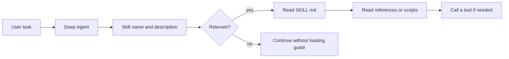
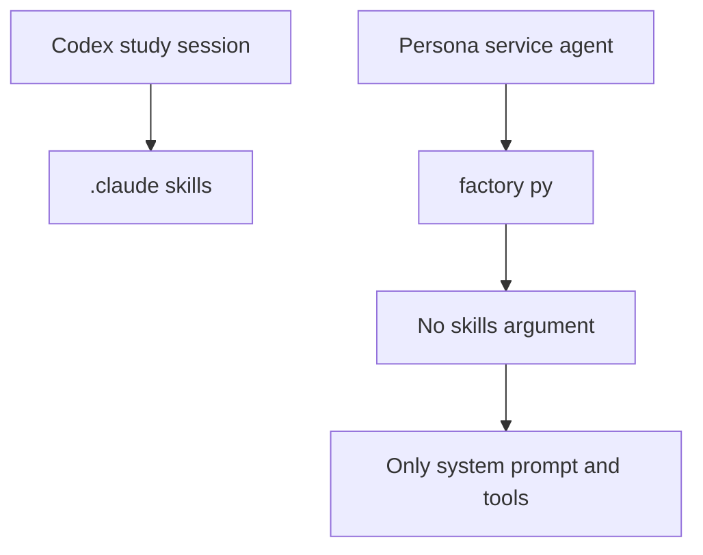

# 10. Skills — Agent에게 재사용 가능한 작업 방법을 가르치기

> 공식 문서: [Deep Agents — Skills](https://docs.langchain.com/oss/python/deepagents/skills)  
> 현재 상태: 이 프로젝트의 Persona Deep Agent에는 `skills=`가 설정되어 있지 않다. 따라서 Deep Agents Skill은 아직 사용하지 않는다.

## 핵심 한 줄

Skill은 Agent가 **어떻게 일을 수행할지**를 담아 두는 재사용 가능한 작업 안내서다. Tool처럼 외부 동작을 실행하지는 않는다.



## Tool, Skill, Memory를 나누어 보기

| 개념 | Agent에게 주는 것 | 예시 |
|---|---|---|
| Tool | 실제로 할 수 있는 행동 | `save_character()`로 캐릭터 저장 |
| Skill | 행동 순서와 판단 규칙 | “통화 분석 시 개인정보를 추측하지 말고 근거를 표시한다” |
| Memory | 다음 대화에도 남길 사실·선호 | “이 사용자는 짧은 응답을 선호한다” |
| System prompt | 매번 적용할 기본 역할·규칙 | “너는 AI 대신받기 캐릭터 편집 도우미다” |

Skill이 Tool을 **호출할 수는 있지만**, Skill 자체가 HTTP 요청·DB 저장을 실행하는 것은 아니다. 그런 실행 권한은 Tool에 있다.

## 왜 모든 내용을 프롬프트에 넣지 않을까

Deep Agents Skill은 필요한 정보만 단계적으로 읽는다.

```text
Agent 시작
  1. 모든 Skill의 name, description만 읽음
  2. 현재 요청과 맞는 Skill의 SKILL.md를 읽음
  3. SKILL.md가 가리키는 references, scripts, assets를 필요할 때만 읽음
```

그래서 “통화 분석”, “캐릭터 수정”, “품질 점검”처럼 서로 다른 긴 작업 설명을 한 시스템 프롬프트에 전부 넣지 않아도 된다.

## 이 프로젝트에서 이미 존재하는 Skill과 차이

`.claude/skills/deepagents-study-expert/SKILL.md`는 **Codex가 이 저장소에서 Deep Agents를 함께 공부할 때 쓰는 로컬 Skill**이다.

반면 `app/agents/factory.py`의 `build_persona_agent()`와 `build_character_chat_agent()`는 `create_deep_agent(...)`에 `skills=`를 넘기지 않는다. 즉 서비스에서 실행되는 Persona Agent는 이 로컬 Skill을 자동으로 읽지 않는다.



## 나중에 만들 수 있는 Persona 분석 Skill

예를 들어 다음은 재사용할 만한 **절차적 지식**이다.

```text
skills/
  call-persona-analysis/
    SKILL.md
    references/
      evidence-rules.md
      privacy-rules.md
```

`SKILL.md`에는 이런 규칙을 둔다.

1. 발화 내용에 근거가 있는 특징만 추출한다.
2. 민감한 개인정보와 건강·정치 성향은 추측하지 않는다.
3. 각 특징에 근거 발화를 연결한다.
4. 확신이 낮으면 저장 Tool을 호출하지 않고 확인을 요청한다.

여기서 저장 자체는 여전히 `save_character()` 같은 Tool의 책임이다.

## Deep Agents에 연결하는 방식

공식 API에서는 `create_deep_agent(..., skills=[...])`로 Skill 경로를 전달한다. 파일이 어디에 놓이는지는 Backend가 결정한다.

| Backend | Skill 파일 위치 | 이 POC에서의 판단 |
|---|---|---|
| `StateBackend` 기본값 | 현재 thread의 Agent state | 실습은 가능하지만 매 실행에 파일을 seed해야 함 |
| `FilesystemBackend` | 서버 디스크 | 웹 서비스에 곧바로 적용하지 않음. 파일 권한 설계가 먼저 필요 |
| `StoreBackend` | thread를 넘어 공유 가능한 store | 사용자별·조직별 Skill 라이브러리가 필요할 때 후보 |

현재는 기능 변경 없이 “분석 규칙을 Skill으로 분리하면 무엇이 달라지는가”를 학습하는 단계가 적절하다. 실제 도입 시에는 어떤 규칙이 매 요청 기본 규칙인지(System prompt), 어떤 규칙이 특정 분석에만 필요한지(Skill)부터 나눈다.

## 이번 장에서 기억할 것

```text
Tool   = 실행 손
Skill  = 실행 방법이 적힌 작업 매뉴얼
Memory = 다음에도 기억할 사실
```

다음 장인 Memory에서는 이 세 번째 상자와 `thread_id`, Checkpointer, 현재 `conversation_store`가 각각 무엇을 기억하는지 분리해서 본다.
