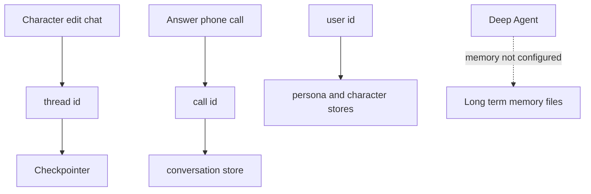
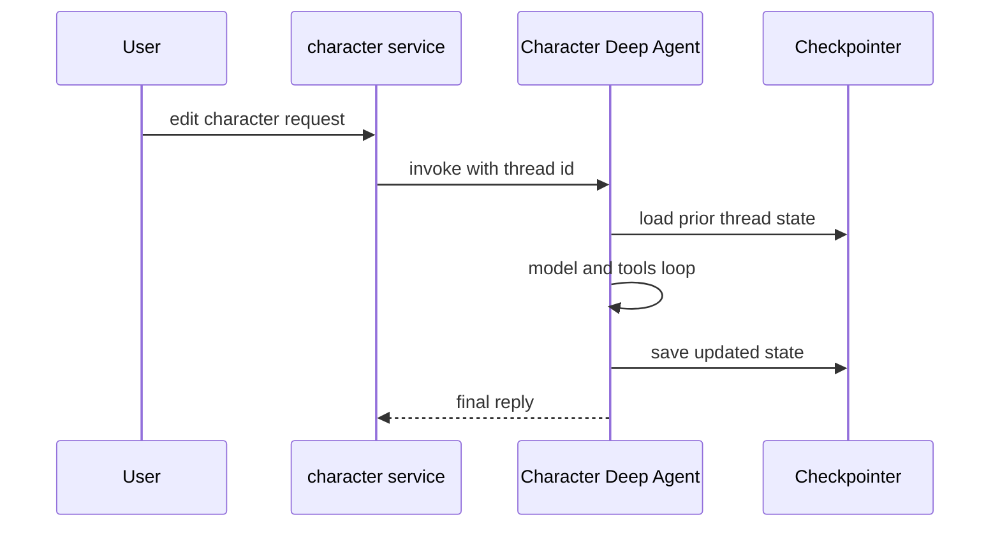
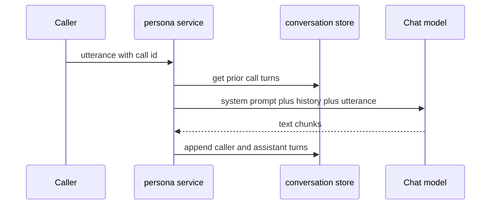
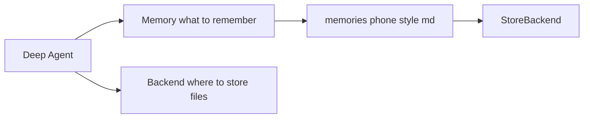
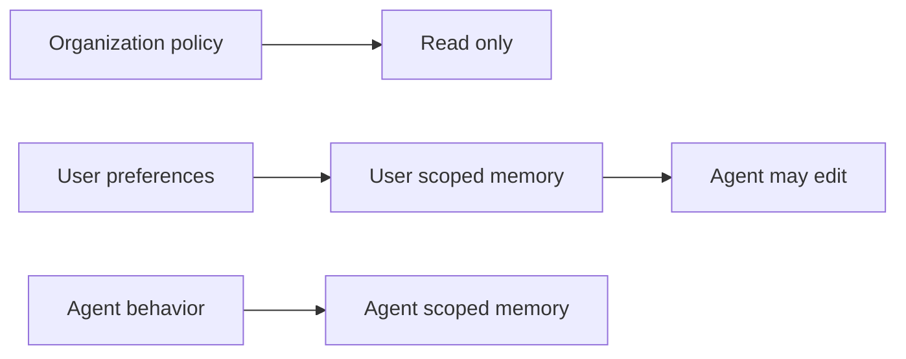

# 11. Memory — 무엇을, 어느 범위까지, 누가 기억하는가

> 공식 문서: [Deep Agents — Memory](https://docs.langchain.com/oss/python/deepagents/memory)  
> 현재 상태: 캐릭터 편집 Agent에는 인메모리 Checkpointer가 있다. Deep Agents 장기 Memory(`memory=`)는 설정하지 않았다.

## 핵심 한 줄

Memory는 하나의 저장소 이름이 아니다. **무엇을 기억하는지, 어느 대화까지 이어지는지, 누가 읽을 수 있는지**에 따라 다른 저장 장치가 필요하다.



## 현재 프로젝트의 네 가지 기억

| 기억하는 대상 | 저장 장치 | 키 | 쓰는 코드 | 현재 수명 |
|---|---|---|---|---|
| 캐릭터 수정 Agent의 대화·Tool loop 상태 | `CHECKPOINTER` | `character-chat:{user_id}` | `factory.py`, `character_service.py` | 서버 프로세스가 살아 있는 동안 |
| 한 통화의 이전 발화 | `conversation_store` | `call_id` | `persona_service.py` | 서버 프로세스가 살아 있는 동안 |
| 확정된 사용자 페르소나·캐릭터 | `persona_store`, `character_store` | `user_id` | 각 service와 Tool | 서버 프로세스가 살아 있는 동안 |
| Agent가 다음 대화에도 학습한 사실·선호 | Deep Agents `memory=[...]` 파일 | Backend namespace | 현재 미사용 | 해당 없음 |

모두 인메모리 구현이라 서버를 재시작하면 사라진다. 이는 POC에서는 의도된 단순화다.

## 가장 헷갈리기 쉬운 두 흐름

### 1. 캐릭터 편집: Checkpointer를 사용한다



`app/services/character_service.py`는 사용자마다 `character-chat:{user_id}`라는 동일한 `thread_id`를 넘긴다. LangGraph runtime이 이 ID로 `CHECKPOINTER`에서 이전 Agent 상태를 읽고, 실행 뒤 새 snapshot을 저장한다.

여기서 Checkpointer는 **대화의 주체가 아니다**. `thread_id`와 함께 Agent runtime이 요청할 때 상태를 꺼내 주는 저장 장치다.

### 2. 대신받기 통화: Checkpointer를 사용하지 않는다



`answer_turn()`은 Deep Agent가 아니라 `runner.stream_reply()`를 통해 채팅 모델을 직접 스트리밍한다. 따라서 `CHECKPOINTER`는 이 흐름에 참여하지 않는다. `conversation_store.get(request.call_id)`가 이전 통화 발화를 가져오고, 서비스 코드가 이를 모델 메시지에 직접 넣는다.

## Deep Agents의 장기 Memory는 무엇인가

공식 문서의 Memory는 대화가 끝나도, 심지어 다른 `thread_id`로 시작해도 유지되는 **파일 기반 장기 기억**이다.

```text
memory=["/memories/preferences.md"]

preferences.md
  - 사용자는 짧고 정중한 대신받기 문장을 선호한다.
  - 가족 연락처에는 친근한 말투를 사용한다.
```

Agent는 이 파일을 읽고 필요하면 내장 `edit_file` Tool로 갱신할 수 있다. 파일이 실제로 어디에 저장되는지는 Backend가 정한다. 사용자별 장기 기억이라면 보통 user namespace를 써서 다른 사용자의 정보가 섞이지 않게 한다.

현재 `build_character_chat_agent()`에는 `checkpointer=CHECKPOINTER`만 있고 `memory=[...]`와 `StoreBackend` 설정은 없다. 즉, **Checkpointer가 있다고 해서 장기 Memory가 자동으로 생기지는 않는다.**

## Memory와 StoreBackend는 다른 층이다

Memory는 “무엇을 기억으로 사용할까”이고, StoreBackend는 “그 파일을 어디에 저장할까”이다. 둘은 경쟁하는 기능이 아니라 함께 조합할 수 있다.



| 질문 | Memory | StoreBackend |
|---|---|---|
| 정체 | `create_deep_agent()`의 `memory=[...]` 설정 | Deep Agents Backend 구현체 |
| 결정하는 것 | 어떤 파일을 기억으로 읽고 갱신할지 | Agent 파일을 어디에·어떤 namespace로 저장할지 |
| 예 | `/memories/phone-style.md` | `(user_id,)` namespace의 LangGraph store |
| thread가 달라도 유지 | 장기 Backend와 조합해야 가능 | 가능 |
| Memory가 아니어도 쓸 수 있나 | 해당 없음 | 가능. 분석 초안·공유 Skill 같은 일반 Agent 파일도 저장 가능 |

```text
memory=["/memories/phone-style.md"]
  = 이 파일을 Agent의 장기 기억으로 읽고 필요하면 갱신한다.

backend=StoreBackend(...)
  = Agent 파일을 thread를 넘어 저장한다.
```

두 설정을 함께 두면 다음 의미가 된다.

```python
create_deep_agent(
    memory=["/memories/phone-style.md"],
    backend=StoreBackend(namespace=lambda runtime: (user_id,)),
)
```

```text
phone-style.md를 장기 기억으로 사용한다
  +
해당 파일은 user_id별 StoreBackend에 보관한다
```

반대로 `StoreBackend`만 설정해도 Agent는 thread 간 파일을 보관할 수 있다. 단, `memory=[...]`가 없다면 그 파일은 특별히 Agent의 기억으로 읽도록 지정되지 않은 일반 작업 파일이다.

```text
Checkpointer = 같은 Agent thread의 실행 이력
StoreBackend = 다른 thread에서도 꺼낼 수 있는 Agent 파일 저장
Memory       = 그 Agent 파일 중 기억으로 읽을 파일 지정
```

## Memory의 세 종류

| 종류 | 질문 | 이 프로젝트의 예 |
|---|---|---|
| Episodic memory | “그때 어떤 순서로 무슨 일이 있었나?” | 캐릭터 편집 Agent의 checkpointed thread |
| Semantic memory | “사용자에 대해 지금도 참인 사실은?” | 장기 Memory 파일 후보, 또는 제품의 Persona record |
| Procedural memory | “이 작업을 어떤 규칙으로 수행하나?” | 10장의 Skill |

`persona_store`는 semantic memory처럼 보일 수 있지만, 더 정확히는 제품이 관리하는 **공식 도메인 데이터**다. Agent가 임의로 장기 Memory 파일에 적어 둔 관찰과 동일하게 취급하면 안 된다.

## 범위와 쓰기 권한



| 범위 | 알맞은 예 | 주의점 |
|---|---|---|
| 사용자 | 말투·호칭·개인 선호 | 반드시 `user_id` 기준으로 격리 |
| Agent | 모든 사용자에게 공통인 작업 노하우 | 한 사용자의 요청이 전체에 섞이면 위험 |
| 조직 | 보안·컴플라이언스 정책 | Agent 쓰기 금지(읽기 전용)가 기본 |

공유 Memory는 한 사용자가 쓴 지시가 다른 사용자에게 보이는 prompt injection 위험이 있다. 그래서 조직 정책이나 개발자가 정의한 Skill은 읽기 전용으로 두는 것이 기본 원칙이다.

## 이 POC에서의 판단

- **설명만:** 현재 Checkpointer와 `conversation_store`의 역할을 구분한다.
- **지금 도입하지 않음:** 장기 Memory, StoreBackend, background consolidation. 영속 저장소를 아직 고려하지 않는 POC 범위를 넘는다.
- **나중의 작은 실습 후보:** 사용자마다 `/memories/phone-style.md` 한 파일을 둔 in-memory `StoreBackend` 실험. 새 `thread_id`에서도 같은 선호가 읽히는지 확인한다.

## 기억할 문장

```text
Checkpointer = 같은 Agent thread의 진행 기록
conversation store = 같은 통화의 대화 이력
domain store = 제품의 공식 사용자 데이터
Deep Agents Memory = 다른 대화에도 이어지는 Agent의 장기 파일 기억
```

다음 장은 Context engineering이다. 장기적으로 “무엇을 저장할까”보다 먼저, 통화 원문과 이력을 **이번 모델 입력에 얼마나 넣고 무엇을 줄일까**를 다룬다.
