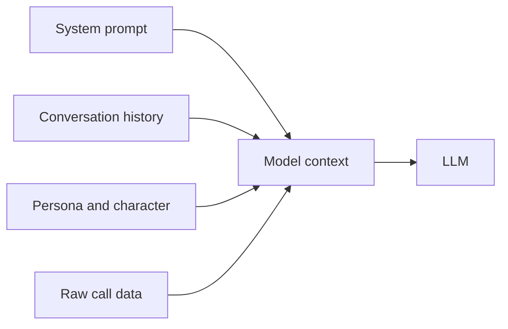
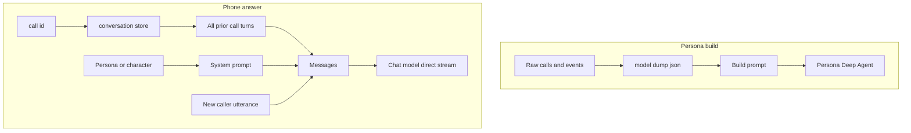
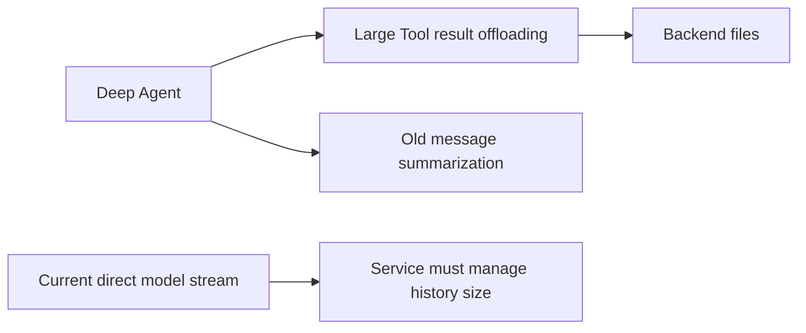

# 12. Context engineering — 모델에게 지금 무엇을 얼마나 보여줄까

> 공식 문서: [Deep Agents — Context engineering](https://docs.langchain.com/oss/python/deepagents/context-engineering)  
> 현재 상태: 통화 원문과 통화 이력을 서비스 코드가 직접 모델 메시지로 조립한다. Deep Agent의 자동 문맥 압축은 대신받기 흐름에 적용되지 않는다.

## 핵심 한 줄

Context engineering은 모델에게 정보를 많이 주는 일이 아니라, **현재 작업에 필요한 정보만 적절한 형태와 크기로 주는 설계**다.



## Deep Agents가 구분하는 문맥

| 종류 | 질문 | 예 |
|---|---|---|
| Input context | 시작할 때 모델이 알아야 하나? | system prompt, Memory, Skill metadata, Tool 설명 |
| Runtime context | 이번 실행의 서버용 값인가? | user ID, 권한, DB 연결, feature flag |
| Agent state | Agent loop 동안 바뀌고 checkpoint되어야 하나? | messages, 파일, 누적 플래그 |
| Context compression | 너무 길어졌을 때 어떻게 줄이나? | 큰 Tool 결과 offloading, 오래된 메시지 요약 |
| Context isolation | 무거운 작업을 주 Agent에서 떼어낼까? | subagent에게 분석 위임 |

`runtime context`는 모델 프롬프트에 자동으로 보이지 않는다. Tool이나 middleware가 읽어야 하며, 이는 LLM이 `user_id`를 고르게 하지 않는 설계와 연결된다.

## 현재 Persona 서비스의 두 문맥 흐름



| 흐름 | 현재 코드 | 문맥이 커지는 지점 |
|---|---|---|
| Persona 구축 | `build_persona()`가 요청 전체를 JSON으로 프롬프트에 넣음 | 통화 건수·STT 원문이 많아질 때 |
| 대신받기 | `answer_turn()`이 `conversation_store`의 전체 이력을 `messages`에 넣음 | 같은 `call_id`의 대화가 길어질 때 |

현재는 POC이므로 명시적 길이 제한·요약 정책이 없다. 짧은 입력에서는 단순하고 이해하기 좋은 설계다.

## Deep Agent 자동 압축과 현재 직접 stream의 차이



Deep Agents는 긴 Tool 입력·결과를 Backend 파일로 offload하고, 문맥 한계에 가까워진 오래된 메시지를 요약하는 기본 압축 기능을 제공한다.

하지만 현재 대신받기는 `runner.stream_reply()`에서 `build_model().stream(messages)`를 직접 호출한다. 따라서 Deep Agent harness의 자동 offloading·summarization이 이 요청에 끼어들지 않는다. 통화 이력의 길이는 서비스가 직접 관리해야 한다.

## 나중에 적용할 수 있는 작은 정책

```text
최근 N개 발화는 원문 유지
이전 발화는 통화 요약 한 개로 압축
중요 약속·일정·발신자 정보는 구조화된 facts로 별도 유지
```

이것은 Memory를 바로 도입하자는 뜻이 아니다. 이력의 **입력 크기 관리**와 대화 간 **장기 기억**은 다른 문제다.

| 문제 | 먼저 고려할 것 |
|---|---|
| 한 통화가 길어져 TTS 응답이 늦음 | 최근 턴 window + 이전 통화 요약 |
| 원시 통화 수백 건으로 Persona 재구축 | STT segment 정제·chunk·요약·근거 추출 파이프라인 |
| 사용자 선호를 다른 대화에도 유지 | 11장의 Memory 후보 |
| 복잡한 분석 Tool 결과가 주 Agent를 채움 | 14장의 subagent 또는 Deep Agent offloading |

## 이 POC에서의 판단

- **설명만:** 현재 입력이 어떻게 모델 context가 되는지 이해한다.
- **권장 개선(통화 길이가 늘면):** `conversation_store` 이력 window와 요약 규칙을 서비스 계층에 추가한다.
- **지금 도입하지 않음:** custom state schema, middleware, 장기 Memory. POC에서 먼저 데이터 크기와 응답 지연을 관찰한 뒤 선택한다.

## 기억할 문장

```text
Context engineering = 모델이 알아야 할 정보의 선택과 압축
Memory = 대화가 달라도 남길 정보를 저장
현재 직접 model stream = 통화 이력 크기를 서비스가 관리
```
