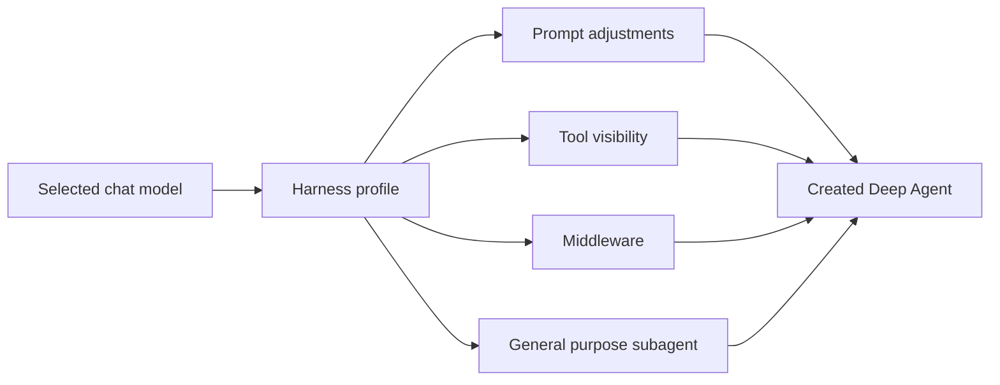
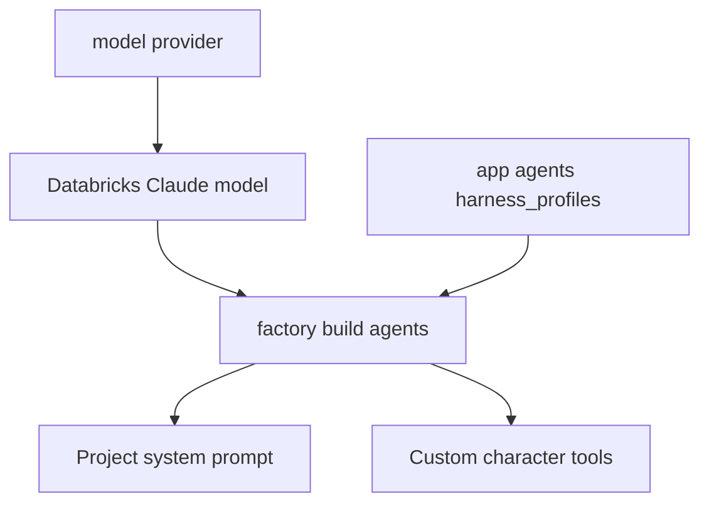

# 13. Profiles — 모델별 Deep Agent harness 설정 묶음

> 공식 문서: [Deep Agents — Profiles](https://docs.langchain.com/oss/python/deepagents/profiles)  
> 상태: **Beta**. `databricks-claude-opus-4-6`에 적용하는 Harness Profile을 추가했다.

## 핵심 한 줄

Deep Agents의 Profile은 사용자 페르소나가 아니라, **특정 모델을 쓸 때 Deep Agent harness를 어떻게 조립할지 정하는 설정 묶음**이다.



## 이름이 비슷하지만 전혀 다른 세 대상

| 이름 | 이 프로젝트에서의 의미 | 위치 |
|---|---|---|
| `PersonaProfile` | 통화 데이터로 만든 사용자의 성향 데이터 | `app/schemas/persona.py` |
| `CharacterProfile` | 대신받기 캐릭터의 말투·설정 데이터 | `app/schemas/character.py` |
| Harness Profile | 모델별 Agent 동작 조립 규칙 | Deep Agents 설정 |

`PersonaProfile`과 Harness Profile은 이름만 같을 뿐 연결되지 않는다.

## Harness Profile이 바꿀 수 있는 것

```text
base_system_prompt         Deep Agents 기본 프롬프트 교체
system_prompt_suffix       마지막에 규칙 추가
tool_description_overrides Tool 설명 교체
excluded_tools             모델에게 특정 Tool 숨김
extra_middleware           모든 Agent stack에 middleware 추가
general_purpose_subagent   기본 subagent 끄기·이름·프롬프트 조정
```

이 설정은 `create_deep_agent()` 호출부를 하나씩 수정하지 않고도, 선택된 모델에 따라 harness 동작을 조정하는 수단이다.

## 현재 프로젝트와의 연결



현재 `app/agents/harness_profiles.py`가 Databricks endpoint의 실제 Deep Agents 조회 키인
`openai:databricks-claude-opus-4-6`에 Profile을 등록한다. Databricks가 OpenAI 호환
`ChatOpenAI`로 모델을 만들기 때문에, 키가 `databricks:...`가 아니라 `openai:...`인 점이 핵심이다.

`app/agents/factory.py`의 `build_model()`은 모델을 만든 뒤 Agent를 조립하기 전에 이 등록을 보장한다.
현재 Profile은 다음 최소 조정만 한다.

| 설정 | 효과 | 선택 이유 |
|---|---|---|
| `system_prompt_suffix` | Tool 결과가 확인되기 전 저장·변경·조회 성공을 말하지 않게 안내 | 현재 Tool 결과 계약과 맞춤 |
| `general_purpose_subagent.enabled=False` | 자동 기본 subagent와 `task` Tool을 제거 | 프로젝트는 별도 subagent를 아직 쓰지 않음 |

이 POC에서 Profile은 제품 규칙을 대신하는 장소가 아니다. 캐릭터별 규칙은 기존
`CHARACTER_CHAT_PROMPT`에, 인증·권한은 API/Tool 경계에 둔다. Profile은 **이 모델로
만든 모든 Deep Agent의 harness 동작**만 조정한다.

## 언제 후보가 되는가

| 상황 | Harness Profile이 유용한 이유 |
|---|---|
| 모델을 여러 제공자로 교체하며 Tool 호출 품질이 다름 | 모델별 Tool 설명·프롬프트 미세 조정 |
| 특정 모델에는 `execute` 같은 Tool을 숨기고 싶음 | 모델별 Tool visibility 일괄 관리 |
| 모든 Agent에 공통 middleware를 넣음 | factory마다 중복하지 않음 |
| 기본 general-purpose subagent를 모델별로 조정 | harness 수준에서 일관되게 변경 |

Profile은 보안 경계가 아니다. Tool을 숨기는 것은 모델이 선택하지 못하게 하는 설정이며, 실제 권한·데이터 접근 통제는 Tool 구현과 Permissions가 책임진다.

## 이 POC에서의 판단

- **작은 실습 적용:** 기본 Databricks Claude endpoint에 Tool 결과 안내와 기본 subagent 비활성화를 적용했다.
- **다음 비교 실습:** 모델 제공자를 둘 이상 비교할 때, 같은 시나리오에 Profile 유무를 비교한다.
- **주의:** 다른 provider로 전환하면 이 Profile은 적용하지 않는다. 모델별 정책을 별도로 등록해야 한다.

## 기억할 문장

```text
PersonaProfile = 사용자의 데이터
Harness Profile = 모델별 Deep Agent 조립 규칙
```
