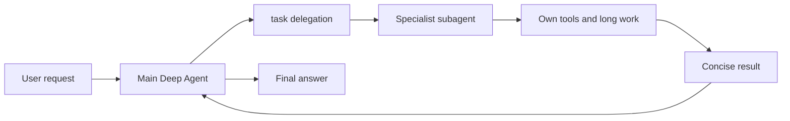
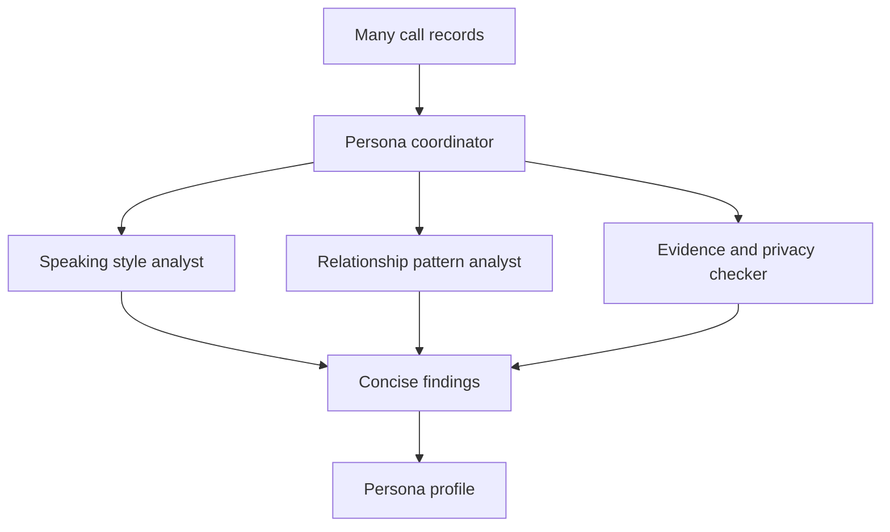
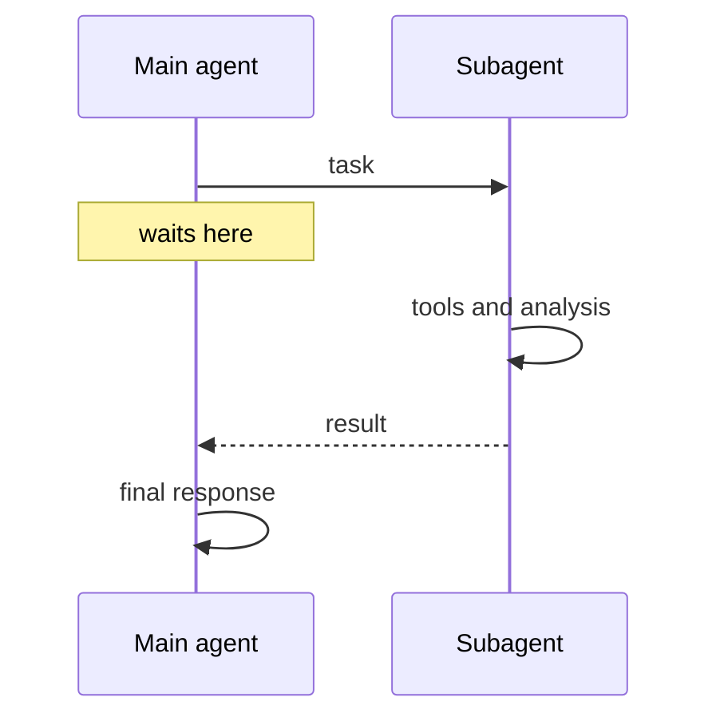

# 14. Subagents — 무거운 전문 작업을 분리해 위임하기

> 공식 문서: [Deep Agents — Subagents](https://docs.langchain.com/oss/python/deepagents/subagents)  
> 현재 상태: 별도 전문 subagent는 정의하지 않았다. Deep Agents 문서 기준으로 synchronous general-purpose subagent는 기본으로 추가될 수 있지만, 현재 POC 흐름에서 `task` 위임을 사용하지 않는다.

## 핵심 한 줄

Subagent는 주 Agent가 작업을 위임하고 **결과만 돌려받도록** 하는 별도 Agent다. 핵심 가치는 병렬 처리보다 먼저, 무거운 중간 문맥을 주 Agent에서 격리하는 데 있다.



## 왜 필요한가

```text
주 Agent가 직접 30개 통화 원문을 읽고
검색·정리·분석 결과까지 모두 들고 있으면
주 Agent의 context가 중간 결과로 가득 찬다.

subagent는 그 상세 작업을 자기 context에서 수행하고
주 Agent에는 요약 결과만 돌려준다.
```

| 적합 | 부적합 |
|---|---|
| 여러 단계·큰 Tool 결과가 있는 분석 | 단순 한 번의 응답 생성 |
| 전문 프롬프트·Tool set이 필요한 작업 | 중간 추론을 주 Agent가 계속 참조해야 하는 작업 |
| 주 Agent는 조정, subagent는 상세 작업 | 위임 비용이 작업 자체보다 큰 경우 |

## Persona 서비스에 대입해 보기



이 분해는 통화가 아주 많고 분석 기준이 복잡할 때의 후보다. 지금 `build_persona()`는 원시 요청 전체를 하나의 Agent에 넘겨 구조화 출력만 받으므로, subagent를 쓸 만큼의 Tool loop·분석 단계가 아직 없다.

## 동기 Subagent의 실행 방식



동기 subagent는 주 Agent가 결과를 받을 때까지 기다린다. 그래서 “통화 분석 결과가 반드시 있어야 최종 Persona를 만들 수 있다”처럼 결과 의존성이 있을 때 맞는다.

## 현재 코드에서 확인할 점

`factory.py`에는 `subagents=` 인자가 없고, `persona_service.build_persona()`도 `task` 결과를 조합하는 코드를 두지 않는다. 따라서 **프로젝트가 정의한 전문 subagent는 없다.**

다만 최신 Deep Agents 문서는 동기 `general-purpose` subagent를 자동으로 추가할 수 있다고 설명한다. 이것은 harness가 제공하는 일반 위임 선택지이며, LLM이 실제로 `task`를 호출해야 실행된다. 현재 POC의 모델 호출을 관찰하거나 `task` 사용을 프롬프트로 요구하지 않았으므로, 제품 기능에 의존하면 안 된다.

## 설계 규칙

| 규칙 | 이유 |
|---|---|
| subagent 설명을 구체적으로 쓴다 | 주 Agent가 무엇을 위임할지 판단하는 근거 |
| Tool set을 최소화한다 | 권한·비용·혼동 감소 |
| 결과 형식을 작고 명확하게 만든다 | context isolation 효과 유지 |
| 모델을 작업별로 선택한다 | 모든 분석에 가장 비싼 모델이 필요하지 않을 수 있음 |
| 정식 Persona 저장은 coordinator 또는 서버가 한다 | 여러 subagent의 동시 쓰기 충돌 방지 |

## 이 POC에서의 판단

- **설명만:** 주 Agent의 context를 깨끗하게 유지하는 위임 경계를 이해한다.
- **작은 실습 후보:** 가짜 통화 데이터에서 `style-analyst` 하나만 추가해 근거 3개와 요약만 반환하게 한다.
- **지금 도입하지 않음:** 현재 Persona 구축은 한 번의 구조화 출력이고, 대신받기는 낮은 지연이 우선이다.

## 기억할 문장

```text
Subagent = 결과를 기다리는 동기 위임
가장 큰 목적 = 병렬화보다 context isolation
```
