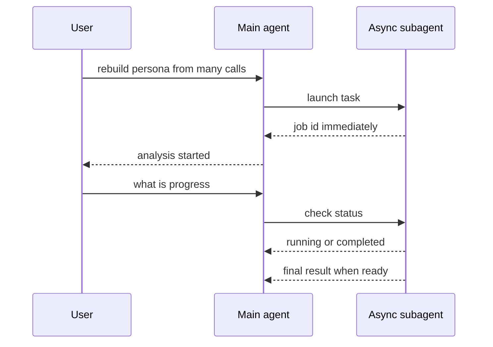
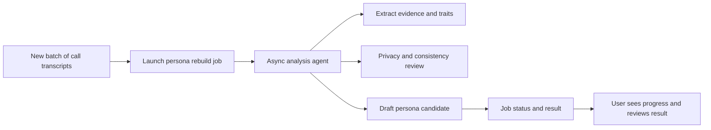

# 15. Async subagents — 기다리지 않고 백그라운드 Agent 작업을 맡기기

> 공식 문서: [Deep Agents — Async subagents](https://docs.langchain.com/oss/python/deepagents/async-subagents)  
> 상태: Preview. 현재 프로젝트에는 AsyncSubAgent·Agent Protocol 서버·작업 상태 API가 없다.

## 핵심 한 줄

Async subagent는 주 Agent가 긴 작업을 시작하고 **job ID를 즉시 받은 뒤**, 사용자와 계속 대화하면서 진행 조회·추가 지시·취소를 할 수 있게 한다.



## 동기와 Async의 차이

| 질문 | 동기 Subagent | Async subagent |
|---|---|---|
| 주 Agent는 결과를 기다리나? | 예, block됨 | 아니오, job ID를 받고 계속 진행 |
| 중간 지시·취소 | 불가 | 가능 |
| 상태 | 호출 단위로 끝남 | 자기 thread에서 상태 유지 |
| 적합 | 결과가 바로 필요한 세부 분석 | 오래 걸리는 분석·여러 병렬 작업·사용자 개입 |
| 인프라 | 같은 Deep Agents 실행 안에서 가능 | Agent Protocol 서버 필요 |

Async는 파이썬의 `async def`와 같은 뜻이 아니다. 이것은 **별도 Agent 작업을 백그라운드 job으로 운영하는 제품 기능**이다.

## Persona 서비스에 대입해 보기



예를 들어 수백 건의 통화를 다시 분석하는 일은 Async 후보가 될 수 있다. 하지만 결과를 만들기 전에 현재 Persona를 바꾸면 안 된다. job이 만든 결과에는 입력 통화의 버전·생성 시각을 붙이고, 완료 뒤 사용자가 확인하거나 서버가 일관성 검사를 한 다음 저장해야 한다.

## Async subagent가 추가로 요구하는 것

| 필요 요소 | 현재 POC | 왜 필요한가 |
|---|---|---|
| Agent Protocol 서버 | 없음 | 작업을 독립 Agent에 전달 |
| graph ID와 transport | 없음 | 같은 배포 ASGI 또는 원격 HTTP 연결 |
| job ID와 상태 조회 UI/API | 없음 | 시작·진행·완료·실패를 사용자에게 전달 |
| update/cancel 권한 | 없음 | 누가 작업을 조작할 수 있는지 통제 |
| 결과 반영 정책 | 없음 | 늦게 끝난 이전 job이 최신 Persona를 덮지 않게 함 |

```text
Async subagent 도입 = Agent 한 줄 추가가 아님
                     + 작업 수명주기와 결과 일관성 설계
```

## 현재 POC에서 사용하지 않는 이유

현재 `build_persona()`는 HTTP 요청 안에서 Agent를 호출하고 Persona를 바로 저장해 반환한다. `answer_turn()`은 TTS 지연을 줄이기 위해 모델을 직접 스트리밍한다. 두 흐름 모두 background job 관리보다 단순성이 더 중요하다.

따라서 지금은 Async subagent를 추가하지 않는다. 먼저 통화 데이터 배치가 실제로 길어지는지, 사용자가 진행 상태·취소·재시도를 필요로 하는지 관찰한 뒤 도입한다.

## 기억할 문장

```text
Sync subagent  = 결과를 기다리는 위임
Async subagent = job ID만 받고 계속 대화하는 위임
Async의 핵심 비용 = Agent 실행보다 job lifecycle 관리
```
