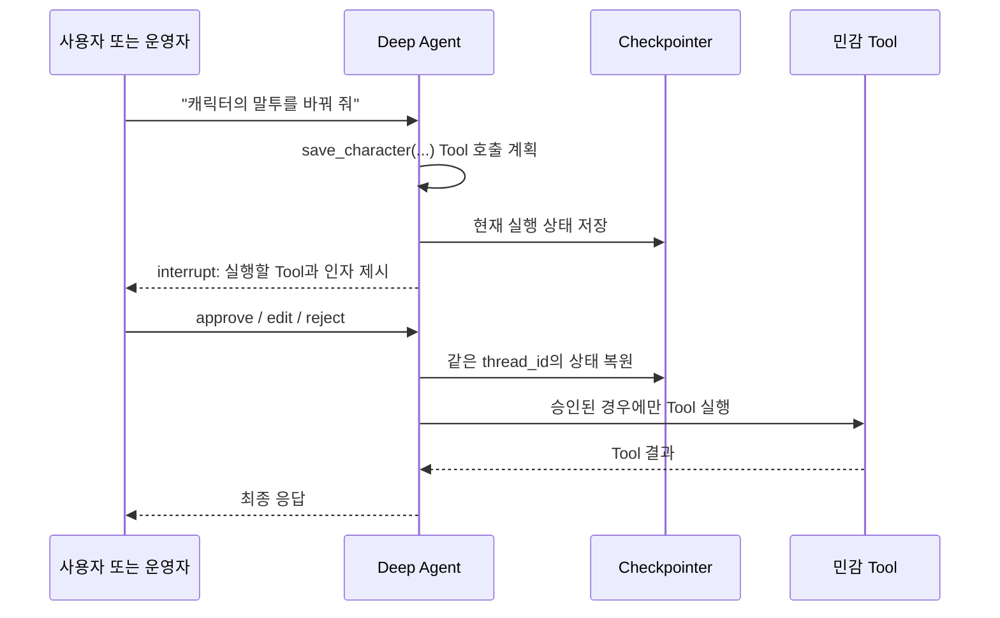
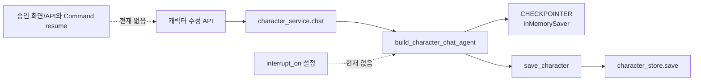

# 16. Human-in-the-loop — Agent의 Tool 실행을 사람에게 승인받기

> 공식 문서: [Deep Agents — Human-in-the-loop](https://docs.langchain.com/oss/python/deepagents/human-in-the-loop)  
> 현재 설치 버전: `deepagents 0.6.12`  
> 현재 상태: 캐릭터 수정 Agent에는 체크포인터가 있지만 `interrupt_on` 설정은 없다.

## 핵심 한 줄

Human-in-the-loop(HITL)은 Agent가 **민감한 Tool을 실행하기 직전 멈추고**, 사람이 승인·수정·거절한 뒤 **같은 작업을 이어서 실행**하게 하는 기능이다.



`interrupt`는 단순한 확인 팝업이 아니다. 그래프 실행을 멈췄다가 **나중에 재개하는 LangGraph 기능**이다. 그래서 상태를 보존할 Checkpointer와 동일한 `thread_id`가 필수다.

## 네 가지 결정

| 결정 | Tool 실행 여부 | 예시 |
|---|---|---|
| `approve` | 원래 인자로 실행 | 제안한 캐릭터 저장 허용 |
| `edit` | 사람이 고친 인자로 실행 | 말투만 수정하고 저장 |
| `reject` | 실행하지 않음 | 저장을 취소하고 Agent에게 이유 전달 |
| `respond` | Tool 대신 사람이 결과를 제공 | `ask_user` Tool의 질문에 답변 |

중요: 부작용이 있는 Tool을 거절할 때 `respond`를 쓰면 Agent가 “성공 결과”로 오해할 수 있다. 저장·발송·삭제를 막을 때는 `reject`가 맞다.

## 현재 프로젝트에 있는 것과 없는 것



`app/services/character_service.py`는 `character-chat:{user_id}`라는 고정 `thread_id`를 사용한다. `app/agents/factory.py`도 `CHECKPOINTER`를 전달한다. 즉 **멈춤과 재개를 위한 상태 기반은 이미 있다.**

하지만 `app/agents/tools.py`의 `save_character()`는 지금 즉시 `character_store.save()`를 호출한다. 현재는 `interrupt_on`도, 중단 결과를 HTTP 응답으로 바꾸는 API도, 재개용 `Command(resume=...)`도 없다.

## `권한` · `확인 UI` · `HITL`은 다르다

| 개념 | 답하는 질문 | 이 프로젝트 예 |
|---|---|---|
| 인증/인가 | “이 사용자가 이 캐릭터를 수정할 자격이 있는가?” | 서버가 로그인 사용자와 `user_id`를 대조 |
| 일반 확인 UI | “사용자가 정말 저장 버튼을 눌렀는가?” | UI가 최종 변경안을 먼저 보여 줌 |
| HITL | “Agent가 **지금 제안한 Tool 인자**로 실행해도 되는가?” | Agent가 만든 `save_character(profile)`를 승인 |

HITL은 인가를 대체하지 않는다. 특히 현재 Tool factory가 `user_id`를 클로저로 고정해도, API 경계의 인증·인가 검증은 별도로 필요하다.

## 공식 API의 모양

다음은 학습용 축약 예시다. 아직 프로젝트 코드에 적용하지 않는다.

```python
agent = create_deep_agent(
    model=build_model(),
    tools=make_character_tools(user_id),
    interrupt_on={
        "save_character": {
            "allowed_decisions": ["approve", "edit", "reject"],
        },
    },
    checkpointer=CHECKPOINTER,
)
```

Agent 호출 결과에 interrupt가 있으면 서버는 Tool 이름과 인자를 UI에 전달한다. 사용자는 결정 하나를 보내고, 서버는 **같은 `thread_id`**로 `Command(resume={"decisions": [...]})`를 호출한다.

```text
첫 요청: invoke("말투를 더 친근하게")
  → interrupt: save_character(profile={...})

두 번째 요청: invoke(Command(resume={"decisions": [{"type": "approve"}]))
  → 같은 thread_id
  → save_character 실행 → 최종 답변
```

한 번에 여러 민감 Tool이 호출되면 한 interrupt에 묶일 수 있고, 결정 배열의 순서는 Agent가 제시한 Tool 호출 순서와 맞아야 한다.

## 언제 이 프로젝트에 적합한가

| 상황 | HITL 적합도 | 이유 |
|---|---:|---|
| 사용자가 직접 “이 변경을 저장”을 누른 캐릭터 편집 | 보통 | 이미 사용자의 의도가 명확하면 일반 확인 UI가 더 단순할 수 있음 |
| Agent가 통화에서 예약을 확정·취소 | 높음 | 실제 외부 상태를 바꾸므로 Agent의 추측을 막아야 함 |
| 고객에게 SMS·메일을 발송 | 높음 | 수신자·문구·개인정보를 사람이 검토 가능 |
| 대신받기 중 즉시 TTS 응답 | 낮음 | 매 문장을 사람 승인을 기다리면 통화가 멈춤 |
| Persona 분석 결과 생성 | 낮음 | 결과는 먼저 초안으로 보여 주고, 저장 시점에 확인하는 편이 자연스러움 |

## POC에서의 판단

**설명만:** 지금은 도입하지 않는다. 캐릭터 수정은 사용자가 채팅으로 이미 요청한 뒤 같은 화면에서 결과를 받는 흐름이라, 매 Tool 호출을 중단시키는 것보다 “저장 전 변경안 미리보기”가 이해하기 쉽다.

**권장 개선(나중):** 예약 확정·외부 발송처럼 되돌리기 어렵거나 제3자에게 영향을 주는 Tool이 생길 때 HITL을 사용한다. 그때는 다음도 함께 필요하다.

1. `interrupt_on` 위험도 정책
2. pending approval ID와 만료 시간
3. 승인자와 원 요청자의 권한 검증
4. 같은 `thread_id`로 재개하는 API
5. 거절·타임아웃·중복 승인 감사 기록

## 기억할 문장

```text
Tool 권한 = 실행할 자격을 서버가 판단한다.
HITL 승인  = Agent가 제안한 이번 실행을 사람이 판단한다.
Checkpointer = 멈춘 Agent가 같은 작업을 다시 이어 갈 수 있게 한다.
```
