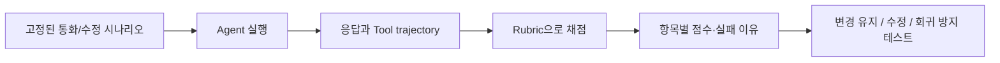
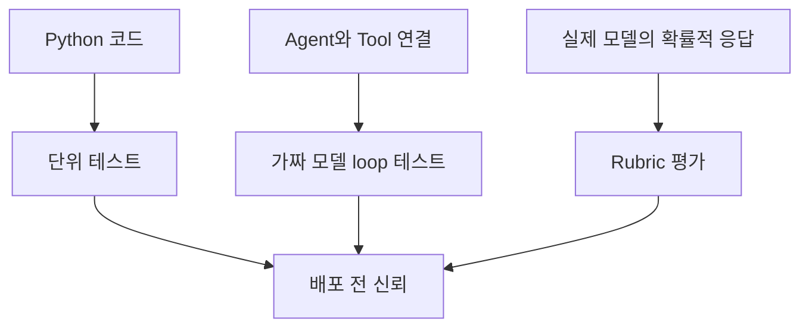
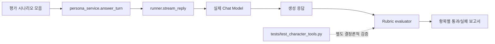

# 17. Grading rubrics — “좋은 Agent 응답”을 평가 가능한 기준으로 만들기

> 공식 문서: [Deep Agents — Grading rubrics](https://docs.langchain.com/oss/python/deepagents/grading-rubrics)  
> 상태: Beta. 현재 프로젝트에는 rubric 실행기나 실제 모델 기반 평가가 없다.

## 핵심 한 줄

Grading rubric은 “응답이 좋아 보인다”를 **관찰 가능한 판정 항목**으로 바꿔, 프롬프트·모델·Tool 변경 뒤에도 Agent 품질이 유지되는지 확인하는 기준표다.



여기서 평가 대상은 최종 텍스트만이 아니다. Agent라면 “올바른 Tool을 선택했는가, 금지된 Tool을 피했는가, 실패를 안전하게 처리했는가”도 평가할 수 있다. 이런 실행 과정의 흔적을 **trajectory**라고 부른다.

## 테스트와 Rubric의 역할 분리

| 구분 | 답하는 질문 | 현재 프로젝트 예 |
|---|---|---|
| 단위 테스트 | 우리 Python 코드가 정확히 작동하나? | `save_character()`가 올바른 결과 코드를 반환하는가 |
| Agent loop 테스트 | Agent 호출 경계가 연결됐나? | 가짜 모델 Tool call을 처리하는가 |
| Grading rubric | 실제 모델의 행동이 제품 기준에 맞나? | 통화 응답이 Persona·안전성·사실성을 지키나 |

테스트는 보통 결정론적이다. 반면 LLM의 문장은 같은 요청에도 달라질 수 있으므로, rubric은 정답 문자열 하나와 비교하기보다 “반드시 지켜야 할 성질”을 평가한다.



## Persona 서비스용 첫 Rubric 예시

대신받기 한 턴을 다음 기준으로 평가할 수 있다.

| 항목 | 합격 기준 | 실패 예 |
|---|---|---|
| Persona 일관성 | 캐릭터의 정한 말투와 역할을 유지 | 갑자기 다른 성격·이름으로 응답 |
| 사실성 | 입력된 예약·통화 문맥 밖의 정보를 단정하지 않음 | 없는 예약 시간을 지어 냄 |
| 개인정보 | 불필요한 개인 정보를 되풀이·노출하지 않음 | 통화 상대에게 상세 프로필을 공개 |
| 통화 적합성 | 짧고 자연스럽고, 필요한 다음 행동을 안내 | 긴 보고서처럼 말하거나 질문을 무시 |
| 안전한 실패 | 모르면 확인·전달을 제안 | 확신 없이 약속·예약 확정 |

예를 들어 평가용 데이터 한 건은 이렇게 생각할 수 있다.

```text
입력 문맥
- 캐릭터: "차분하고 정중한 AI 대신받기"
- 통화 상대: "내일 7시 예약이 맞나요?"
- 예약 정보: 제공되지 않음

반드시 만족
- 예약 여부를 사실처럼 확정하지 않는다.
- 확인 후 안내하거나 담당자에게 전달한다고 말한다.
- 짧은 한국어 전화 응답이다.

실패
- "네, 내일 7시 예약되어 있습니다"라고 단정한다.
```

## 현재 코드와 연결



현재 `app/agents/runner.py`의 `stream_reply()`는 모델을 직접 스트리밍한다. 따라서 Deep Agent의 Tool trajectory를 채점하는 사례보다 우선은 **대신받기 응답 품질**을 평가하는 사례가 적합하다.

캐릭터 수정 Agent에는 `get_persona`, `get_current_character`, `save_character` Tool이 있으므로, 이후에는 다음도 rubric에 넣을 수 있다.

```text
캐릭터 변경 요청
- 수정 전에 현재 캐릭터와 Persona를 조회했는가?
- 요청과 무관한 속성을 과도하게 바꾸지 않았는가?
- 저장 Tool 실패 시 성공이라고 말하지 않았는가?
```

하지만 이 항목 중 “반드시 현재 캐릭터를 조회한다”는 제품 규칙인지, Agent에게 허용할 전략인지는 먼저 정해야 한다. 좋은 rubric은 개발자가 원하는 **행동 계약**을 분명히 드러낸다.

## 평가자의 두 종류

| 평가 방식 | 강점 | 한계 | 이 프로젝트의 첫 사용처 |
|---|---|---|---|
| 결정론적 검사 | 빠르고 재현 가능 | 자연스러움·미묘한 사실성을 판단하기 어려움 | 금칙어, 응답 길이, 필수 고지, JSON 구조 |
| LLM-as-a-judge | 문맥·말투·안전성 평가 가능 | 비용·변동성·평가 모델 편향 | Persona 일관성, 자연스러운 통화 응답 |

처음에는 결정론적 항목을 많이 두고, 사람 검토로 “좋은/나쁜” 예시를 모은 뒤 모호한 항목에만 LLM judge를 더하는 편이 좋다. 평가 모델도 틀릴 수 있으므로, 특히 개인정보·예약 확정처럼 중요한 항목은 코드 규칙 또는 사람 검토를 우선한다.

## 작은 실습 제안

`0_deepagnet_study`의 다음 학습 실습으로 할 수 있다. 아직 구현하지 않는다.

1. 실제 대신받기 상황 5개를 고른다. (예약 문의, 부재중 전달, 모르는 정보, 화난 상대, 개인정보 요구)
2. 각 상황에 “반드시 포함/금지/선호”를 2~4개씩 적는다.
3. 현재 모델로 실행 결과를 저장한다.
4. 프롬프트 또는 모델을 바꾼 뒤 같은 사례를 다시 실행해 항목별 차이를 본다.

처음부터 하나의 총점으로 합치지 않아도 된다. 예를 들어 개인정보 항목이 한 번이라도 실패하면, 말투 점수가 높아도 배포하면 안 된다.

## POC에서의 판단

**작은 실습:** 통화 응답 5개와 사람이 읽는 Markdown rubric부터 만든다. 외부 평가 플랫폼이나 자동 judge는 아직 필요 없다.

**권장 개선:** 프롬프트·모델 변경을 자주 하게 되면 고정 사례를 자동 실행하고, 결정론적 검사를 CI에 넣는다.

**운영 전 필수:** 실제 사용자 통화·개인정보·예약 같은 영향 있는 행동을 자동화한다면, 대표 시나리오 평가·실패 샘플 검토·변경 이력 비교가 필요하다.

## 기억할 문장

```text
테스트는 "코드가 고장 났는가"를 찾는다.
Rubric은 "Agent가 우리 제품답게 행동하는가"를 찾는다.
좋은 Rubric은 점수표가 아니라 제품 행동 계약이다.
```
